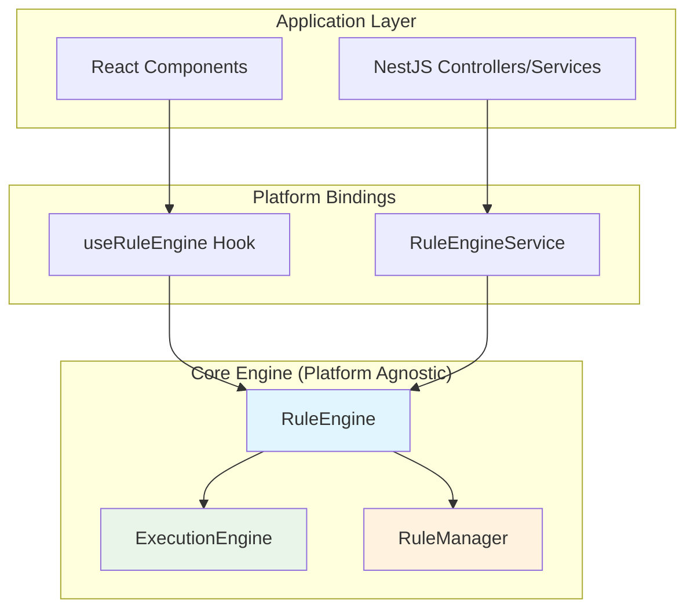
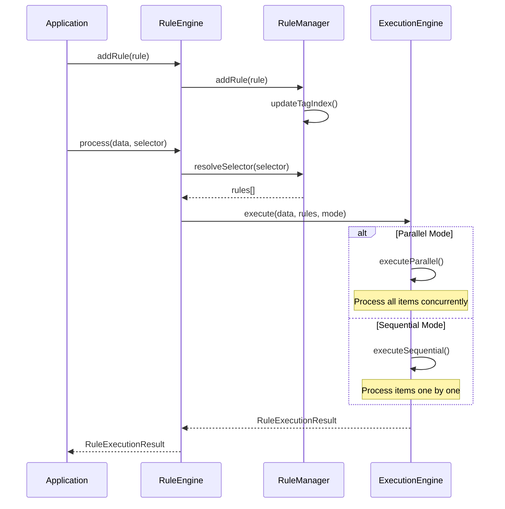
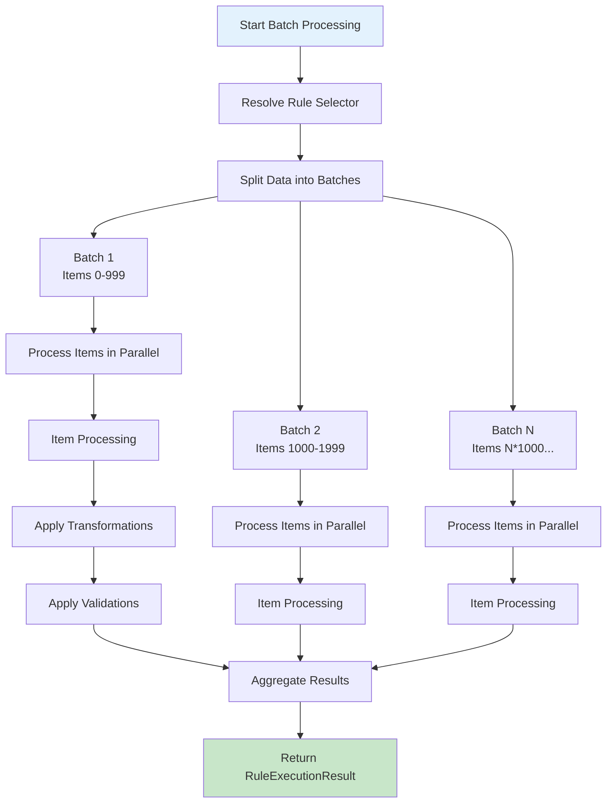

# Design Document: Custom Rule Engine (cm-rule-engine)

## Overview

The `cm-rule-engine` is an ultra-lightweight, high-performance rule engine library designed for both React and NestJS applications. The engine prioritizes raw runtime performance and minimal footprint, supporting massive parallel batch execution (10k+ records) with flexible execution modes selectable at call time.

### Design Principles

1. **Ultra-Lightweight**: Zero external dependencies for core functionality, no logging/monitoring overhead
2. **Maximum Performance**: Optimized for 10k+ parallel record processing
3. **Flexible Execution**: Support both parallel and sequential execution modes per call
4. **Platform Agnostic Core**: Clean separation between core engine and platform bindings
5. **Type Safety**: Full TypeScript support with comprehensive type definitions
6. **Minimal API Surface**: Simple, intuitive API that's easy to learn and use

### Key Differentiators from minimal-gorules

- **No External Rule Storage**: Rules are defined in code, not loaded from cloud/API
- **Simpler Architecture**: No cache manager, loader service, or version management
- **Direct Execution**: Rules execute directly without ZenEngine wrapper
- **Batch-First Design**: Optimized for processing large datasets in parallel
- **Tag-Based Organization**: Rules organized by tags for flexible execution

## Architecture

### High-Level Component Structure

```
cm-rule-engine/
├── src/
│   ├── lib/
│   │   ├── core/                    # Core engine (platform-agnostic)
│   │   │   ├── types.ts             # Core type definitions
│   │   │   ├── rule-engine.ts       # Main rule engine class
│   │   │   ├── execution-engine.ts  # Execution strategies
│   │   │   └── rule-manager.ts      # Rule registration and management
│   │   ├── react/                   # React bindings
│   │   │   ├── index.ts             # React exports
│   │   │   ├── use-rule-engine.ts   # Main React hook
│   │   │   └── types.ts             # React-specific types
│   │   └── nestjs/                  # NestJS bindings
│   │       ├── index.ts             # NestJS exports
│   │       ├── rule-engine.module.ts # NestJS module
│   │       ├── rule-engine.service.ts # NestJS service
│   │       └── types.ts             # NestJS-specific types
│   └── index.ts                     # Main library entry point
├── scripts/
│   └── deploy-to-react.ps1          # React deployment script
└── package.json
```

### Component Relationships



## Components and Interfaces

### 1. Core Types (`core/types.ts`)

#### Rule Definition

```typescript
/**
 * Core rule definition
 */
export interface Rule<TInput = any, TOutput = any> {
  /** Unique rule identifier */
  name: string;
  
  /** Human-readable description */
  description: string;
  
  /** Execution priority (lower = higher priority) */
  priority: number;
  
  /** Tags for rule organization and selection */
  tags?: string[];
  
  /** Whether the rule is enabled */
  enabled: boolean;
  
  /** Transformation function (optional) */
  transform?: (context: RuleContext<TInput>) => TInput | Promise<TInput>;
  
  /** Validation function (optional) */
  validate?: (context: RuleContext<TInput>) => ValidationError[] | Promise<ValidationError[]>;
}

/**
 * Rule execution context
 */
export interface RuleContext<T = any> {
  /** Current item being processed */
  item: T;
  
  /** All items in the dataset (for cross-item validation) */
  allItems: T[];
  
  /** Current item index */
  index: number;
  
  /** Additional metadata (optional) */
  metadata?: Record<string, any>;
}

/**
 * Validation error
 */
export interface ValidationError {
  /** Field that failed validation */
  field: string;
  
  /** Error message */
  message: string;
  
  /** Error severity */
  severity: 'error' | 'warning';
  
  /** Optional item identifier */
  itemId?: string;
}

/**
 * Rule execution result
 */
export interface RuleExecutionResult<T = any> {
  /** Transformed data */
  data: T[];
  
  /** Validation errors */
  errors: ValidationError[];
  
  /** Validation warnings */
  warnings: ValidationError[];
  
  /** Whether validation passed (no errors) */
  isValid: boolean;
  
  /** Execution time in milliseconds */
  executionTime: number;
  
  /** Number of rules executed */
  rulesExecuted: number;
}

/**
 * Batch execution result for individual items
 */
export interface BatchItemResult<T = any> {
  /** Item index in original array */
  index: number;
  
  /** Transformed item */
  data: T;
  
  /** Errors for this item */
  errors: ValidationError[];
  
  /** Warnings for this item */
  warnings: ValidationError[];
  
  /** Whether this item is valid */
  isValid: boolean;
}

/**
 * Execution mode
 */
export type ExecutionMode = 'parallel' | 'sequential';

/**
 * Rule selector for execution
 */
export interface RuleSelector {
  /** Specific rule names to execute */
  names?: string[];
  
  /** Tags to match (executes all rules with any of these tags) */
  tags?: string[];
  
  /** Execution mode */
  mode?: ExecutionMode;
}
```

### 2. Rule Engine (`core/rule-engine.ts`)

The main orchestrator that coordinates rule management and execution.

```typescript
export class RuleEngine<T = any> {
  private ruleManager: RuleManager<T>;
  private executionEngine: ExecutionEngine<T>;
  
  constructor() {
    this.ruleManager = new RuleManager<T>();
    this.executionEngine = new ExecutionEngine<T>(this.ruleManager);
  }
  
  /**
   * Register a new rule
   */
  addRule(rule: Rule<T>): void;
  
  /**
   * Remove a rule by name
   */
  removeRule(name: string): void;
  
  /**
   * Enable a rule
   */
  enableRule(name: string): void;
  
  /**
   * Disable a rule
   */
  disableRule(name: string): void;
  
  /**
   * Get all registered rules
   */
  getRules(): Rule<T>[];
  
  /**
   * Get rules by tags
   */
  getRulesByTags(tags: string[]): Rule<T>[];
  
  /**
   * Process data through all enabled rules
   */
  process(data: T[], mode?: ExecutionMode): Promise<RuleExecutionResult<T>>;
  
  /**
   * Process data through specific rules
   */
  processWithRules(
    data: T[],
    selector: RuleSelector
  ): Promise<RuleExecutionResult<T>>;
  
  /**
   * Process large batch with controlled concurrency
   */
  processBatch(
    data: T[],
    selector: RuleSelector,
    options?: BatchOptions
  ): Promise<RuleExecutionResult<T>>;
}

export interface BatchOptions {
  /** Maximum concurrent items to process */
  maxConcurrency?: number;
  
  /** Execution mode for rules within each item */
  ruleExecutionMode?: ExecutionMode;
  
  /** Continue processing on error */
  continueOnError?: boolean;
}
```

### 3. Rule Manager (`core/rule-manager.ts`)

Manages rule registration, organization, and retrieval.

```typescript
export class RuleManager<T = any> {
  private rules: Map<string, Rule<T>>;
  private tagIndex: Map<string, Set<string>>; // tag -> rule names
  
  /**
   * Add a rule to the registry
   */
  addRule(rule: Rule<T>): void;
  
  /**
   * Remove a rule from the registry
   */
  removeRule(name: string): void;
  
  /**
   * Get a rule by name
   */
  getRule(name: string): Rule<T> | undefined;
  
  /**
   * Get all rules
   */
  getAllRules(): Rule<T>[];
  
  /**
   * Get enabled rules sorted by priority
   */
  getEnabledRules(): Rule<T>[];
  
  /**
   * Get rules by tags
   */
  getRulesByTags(tags: string[]): Rule<T>[];
  
  /**
   * Resolve rule selector to actual rules
   */
  resolveSelector(selector: RuleSelector): Rule<T>[];
  
  /**
   * Enable/disable a rule
   */
  setRuleEnabled(name: string, enabled: boolean): void;
  
  /**
   * Update tag index when rules change
   */
  private updateTagIndex(rule: Rule<T>): void;
}
```

### 4. Execution Engine (`core/execution-engine.ts`)

Handles rule execution with different strategies.

```typescript
export class ExecutionEngine<T = any> {
  constructor(private ruleManager: RuleManager<T>) {}
  
  /**
   * Execute rules on dataset
   */
  async execute(
    data: T[],
    rules: Rule<T>[],
    mode: ExecutionMode
  ): Promise<RuleExecutionResult<T>>;
  
  /**
   * Execute rules in parallel mode
   */
  private async executeParallel(
    data: T[],
    rules: Rule<T>[]
  ): Promise<RuleExecutionResult<T>>;
  
  /**
   * Execute rules in sequential mode
   */
  private async executeSequential(
    data: T[],
    rules: Rule<T>[]
  ): Promise<RuleExecutionResult<T>>;
  
  /**
   * Execute batch with controlled concurrency
   */
  async executeBatch(
    data: T[],
    rules: Rule<T>[],
    options: BatchOptions
  ): Promise<RuleExecutionResult<T>>;
  
  /**
   * Process a single item through rules
   */
  private async processItem(
    item: T,
    index: number,
    allItems: T[],
    rules: Rule<T>[],
    mode: ExecutionMode
  ): Promise<BatchItemResult<T>>;
  
  /**
   * Apply transformation rules
   */
  private async applyTransformations(
    item: T,
    context: RuleContext<T>,
    rules: Rule<T>[],
    mode: ExecutionMode
  ): Promise<T>;
  
  /**
   * Apply validation rules
   */
  private async applyValidations(
    item: T,
    context: RuleContext<T>,
    rules: Rule<T>[],
    mode: ExecutionMode
  ): Promise<ValidationError[]>;
}
```

## Data Models

### Rule Flow



### Batch Processing Flow



## Error Handling

### Error Strategy

1. **Validation Errors**: Collected and returned in result, don't stop execution
2. **Rule Execution Errors**: Caught and logged, execution continues by default
3. **System Errors**: Thrown immediately (e.g., invalid configuration)

### Error Types

```typescript
export class RuleEngineError extends Error {
  constructor(
    message: string,
    public code: RuleEngineErrorCode,
    public context?: any
  ) {
    super(message);
    this.name = 'RuleEngineError';
  }
}

export enum RuleEngineErrorCode {
  RULE_NOT_FOUND = 'RULE_NOT_FOUND',
  INVALID_RULE = 'INVALID_RULE',
  EXECUTION_ERROR = 'EXECUTION_ERROR',
  INVALID_INPUT = 'INVALID_INPUT',
}
```

## Testing Strategy

### Unit Testing

- **Rule Manager**: Test rule registration, retrieval, tag indexing
- **Execution Engine**: Test parallel/sequential execution, batch processing
- **Rule Engine**: Test end-to-end rule processing

### Performance Testing

- **Batch Processing**: Verify 10k+ records can be processed efficiently
- **Parallel Execution**: Measure speedup vs sequential
- **Memory Usage**: Ensure minimal memory footprint

### Integration Testing

- **React Integration**: Test hooks with mock rules
- **NestJS Integration**: Test service injection and module configuration

## React Integration Design

### Hook API

```typescript
export function useRuleEngine<T = any>(
  initialRules?: Rule<T>[]
): UseRuleEngineReturn<T> {
  const [engine] = useState(() => {
    const eng = new RuleEngine<T>();
    initialRules?.forEach(rule => eng.addRule(rule));
    return eng;
  });
  
  const [processing, setProcessing] = useState(false);
  const [result, setResult] = useState<RuleExecutionResult<T> | null>(null);
  
  const process = useCallback(async (
    data: T[],
    selector?: RuleSelector
  ) => {
    setProcessing(true);
    try {
      const res = selector
        ? await engine.processWithRules(data, selector)
        : await engine.process(data);
      setResult(res);
      return res;
    } finally {
      setProcessing(false);
    }
  }, [engine]);
  
  const addRule = useCallback((rule: Rule<T>) => {
    engine.addRule(rule);
  }, [engine]);
  
  const removeRule = useCallback((name: string) => {
    engine.removeRule(name);
  }, [engine]);
  
  const toggleRule = useCallback((name: string, enabled: boolean) => {
    if (enabled) {
      engine.enableRule(name);
    } else {
      engine.disableRule(name);
    }
  }, [engine]);
  
  return {
    engine,
    processing,
    result,
    process,
    addRule,
    removeRule,
    toggleRule,
    getRules: () => engine.getRules(),
    getRulesByTags: (tags: string[]) => engine.getRulesByTags(tags),
  };
}

export interface UseRuleEngineReturn<T = any> {
  engine: RuleEngine<T>;
  processing: boolean;
  result: RuleExecutionResult<T> | null;
  process: (data: T[], selector?: RuleSelector) => Promise<RuleExecutionResult<T>>;
  addRule: (rule: Rule<T>) => void;
  removeRule: (name: string) => void;
  toggleRule: (name: string, enabled: boolean) => void;
  getRules: () => Rule<T>[];
  getRulesByTags: (tags: string[]) => Rule<T>[];
}
```

### Usage Example

```typescript
function MyComponent() {
  const { process, processing, result, addRule } = useRuleEngine<MyDataType>([
    {
      name: 'validate-required',
      description: 'Validate required fields',
      priority: 1,
      enabled: true,
      tags: ['validation'],
      validate: (context) => {
        const errors: ValidationError[] = [];
        if (!context.item.name) {
          errors.push({
            field: 'name',
            message: 'Name is required',
            severity: 'error',
          });
        }
        return errors;
      },
    },
  ]);
  
  const handleProcess = async () => {
    const data = [...]; // your data
    await process(data, { tags: ['validation'] });
  };
  
  return (
    <div>
      <button onClick={handleProcess} disabled={processing}>
        Process Data
      </button>
      {result && (
        <div>
          <p>Valid: {result.isValid ? 'Yes' : 'No'}</p>
          <p>Errors: {result.errors.length}</p>
          <p>Time: {result.executionTime}ms</p>
        </div>
      )}
    </div>
  );
}
```

## NestJS Integration Design

### Module Configuration

```typescript
@Module({})
export class RuleEngineModule {
  static forRoot<T = any>(
    rules?: Rule<T>[]
  ): DynamicModule {
    return {
      module: RuleEngineModule,
      providers: [
        {
          provide: 'RULE_ENGINE_RULES',
          useValue: rules || [],
        },
        RuleEngineService,
      ],
      exports: [RuleEngineService],
      global: true,
    };
  }
}
```

### Service Implementation

```typescript
@Injectable()
export class RuleEngineService<T = any> {
  private engine: RuleEngine<T>;
  
  constructor(
    @Inject('RULE_ENGINE_RULES') rules: Rule<T>[]
  ) {
    this.engine = new RuleEngine<T>();
    rules.forEach(rule => this.engine.addRule(rule));
  }
  
  async process(
    data: T[],
    mode?: ExecutionMode
  ): Promise<RuleExecutionResult<T>> {
    return this.engine.process(data, mode);
  }
  
  async processWithRules(
    data: T[],
    selector: RuleSelector
  ): Promise<RuleExecutionResult<T>> {
    return this.engine.processWithRules(data, selector);
  }
  
  async processBatch(
    data: T[],
    selector: RuleSelector,
    options?: BatchOptions
  ): Promise<RuleExecutionResult<T>> {
    return this.engine.processBatch(data, selector, options);
  }
  
  addRule(rule: Rule<T>): void {
    this.engine.addRule(rule);
  }
  
  removeRule(name: string): void {
    this.engine.removeRule(name);
  }
  
  enableRule(name: string): void {
    this.engine.enableRule(name);
  }
  
  disableRule(name: string): void {
    this.engine.disableRule(name);
  }
  
  getRules(): Rule<T>[] {
    return this.engine.getRules();
  }
  
  getRulesByTags(tags: string[]): Rule<T>[] {
    return this.engine.getRulesByTags(tags);
  }
}
```

### Usage Example

```typescript
@Injectable()
export class BomService {
  constructor(private ruleEngine: RuleEngineService<BomItem>) {
    // Register rules
    this.ruleEngine.addRule({
      name: 'validate-qpa',
      description: 'Validate QPA field',
      priority: 1,
      enabled: true,
      tags: ['validation', 'qpa'],
      validate: (context) => {
        // validation logic
      },
    });
  }
  
  async validateBom(items: BomItem[]): Promise<RuleExecutionResult<BomItem>> {
    return this.ruleEngine.processWithRules(items, {
      tags: ['validation'],
      mode: 'parallel',
    });
  }
  
  async processBomBatch(items: BomItem[]): Promise<RuleExecutionResult<BomItem>> {
    return this.ruleEngine.processBatch(items, {
      tags: ['validation', 'transformation'],
      mode: 'parallel',
    }, {
      maxConcurrency: 1000,
      continueOnError: true,
    });
  }
}
```

## Performance Optimizations

### 1. Parallel Batch Processing

- Process multiple items concurrently using `Promise.all()`
- Configurable concurrency limit to prevent resource exhaustion
- Batch items into chunks for controlled parallel execution

### 2. Efficient Rule Resolution

- Tag index for O(1) tag-to-rule lookup
- Pre-sorted rules by priority
- Cached rule resolution results

### 3. Minimal Memory Footprint

- No caching of execution results
- Streaming-style processing for large datasets
- Efficient data structures (Map, Set)

### 4. Zero Dependencies

- No external libraries for core functionality
- Direct implementation of all algorithms
- Smaller bundle size

## Deployment

### React Deployment

The PowerShell script `scripts/deploy-to-react.ps1` will:

1. Build the library in browser-optimized mode
2. Copy built files to React app's vendor directory
3. Update React app's import paths

### NestJS Deployment

Standard npm package installation:

```bash
npm install @org/cm-rule-engine
```

Import in NestJS module:

```typescript
import { RuleEngineModule } from '@org/cm-rule-engine/nestjs';
```

## Migration from Existing Rule Engine

### Key Differences

| Feature | Old Engine | New Engine |
|---------|-----------|------------|
| Rule Storage | In-code | In-code |
| Execution | Direct | Direct |
| Batch Processing | Limited | Optimized for 10k+ |
| Tag Support | No | Yes |
| Parallel Execution | No | Yes |
| Platform Bindings | React only | React + NestJS |

### Migration Steps

1. Update rule definitions to new `Rule<T>` interface
2. Replace `BOMRuleEngine` with `RuleEngine<T>`
3. Update rule registration from `getAllRules()` to `addRule()`
4. Update execution calls to use new API
5. Add tags to rules for flexible execution
6. Leverage batch processing for large datasets

## Future Enhancements

1. **Rule Composition**: Support for rule dependencies and chaining
2. **Async Validation**: Better support for async validation rules
3. **Performance Metrics**: Built-in performance tracking
4. **Rule Debugging**: Development-mode debugging tools
5. **Rule Testing Utilities**: Helper functions for testing rules
