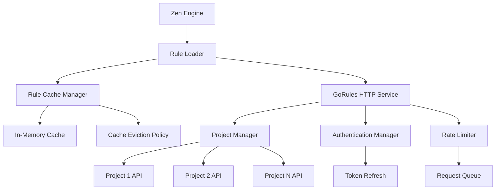
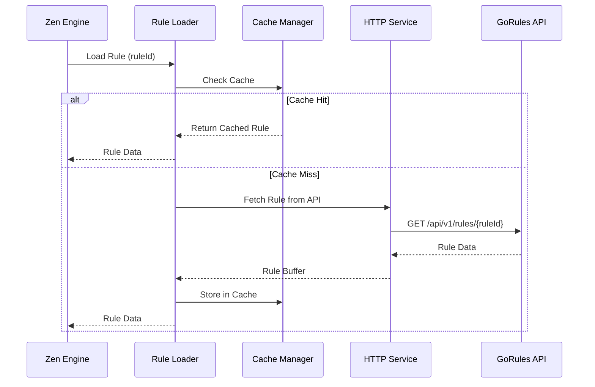

# GoRules Cloud Rule Loading Design Document

## Overview

This design extends the existing GoRules integration to implement dynamic rule loading from the GoRules Cloud API. The solution will replace the current placeholder rule loader implementations with a comprehensive system that fetches rules from the cloud, implements intelligent caching, supports multiple projects, and provides robust error handling.

The implementation will leverage the existing `GoRulesHttpService` and integrate with the Zen Engine's loader mechanism to provide seamless rule loading from the GoRules Cloud API at `triveni.gorules.io`.

## Architecture

### High-Level Architecture



### Component Integration



## Components and Interfaces

### 1. Enhanced Rule Loader Service

**GoRulesCloudLoaderService**

```typescript
interface IGoRulesCloudLoader {
  loadRule(ruleId: string, projectId?: string): Promise<Buffer>;
  loadRuleMetadata(ruleId: string, projectId?: string): Promise<RuleMetadata>;
  validateRuleExists(ruleId: string, projectId?: string): Promise<boolean>;
  preloadRules(ruleIds: string[], projectId?: string): Promise<void>;
  clearCache(ruleId?: string): void;
  getCacheStatistics(): CacheStatistics;
}

interface CacheStatistics {
  totalRules: number;
  cacheHits: number;
  cacheMisses: number;
  hitRatio: number;
  memoryUsage: number;
  evictedRules: number;
}
```

**Implementation Features**

- Integration with Zen Engine loader mechanism
- Intelligent caching with configurable TTL and LRU eviction
- Multi-project support with automatic project detection
- Retry logic with exponential backoff for network failures
- Rate limiting awareness and request queuing
- Comprehensive error handling and fallback strategies

### 2. Rule Cache Manager

**GoRulesRuleCacheService**

```typescript
interface IRuleCacheManager {
  get(ruleId: string): Promise<CachedRule | null>;
  set(ruleId: string, rule: Buffer, metadata: RuleMetadata): Promise<void>;
  invalidate(ruleId: string): Promise<void>;
  clear(): Promise<void>;
  getStatistics(): CacheStatistics;
  cleanup(): Promise<void>;
}

interface CachedRule {
  data: Buffer;
  metadata: RuleMetadata;
  cachedAt: Date;
  lastAccessed: Date;
  accessCount: number;
  ttl: number;
}

interface CacheConfig {
  maxSize: number;
  defaultTtl: number;
  cleanupInterval: number;
  evictionPolicy: 'LRU' | 'LFU' | 'TTL';
  memoryThreshold: number;
}
```

**Cache Features**

- LRU (Least Recently Used) eviction policy
- Configurable TTL (Time To Live) per rule
- Memory usage monitoring and automatic cleanup
- Cache warming for frequently used rules
- Metrics collection for cache performance analysis

### 3. Multi-Project Manager

**GoRulesProjectManagerService**

```typescript
interface IProjectManager {
  addProject(config: ProjectConfig): void;
  removeProject(projectId: string): void;
  getProject(projectId: string): ProjectConfig | null;
  findRuleProject(ruleId: string): Promise<string | null>;
  getAllProjects(): ProjectConfig[];
  validateProjectAccess(projectId: string): Promise<boolean>;
}

interface ProjectConfig {
  projectId: string;
  apiUrl: string;
  apiKey: string;
  priority: number;
  enabled: boolean;
  rateLimit?: RateLimitConfig;
  timeout?: number;
  retryAttempts?: number;
}

interface RateLimitConfig {
  maxRequests: number;
  windowSize: number;
  strategy: 'delay' | 'reject' | 'queue';
}
```

**Project Management Features**

- Dynamic project configuration without restart
- Priority-based rule resolution for multi-project scenarios
- Per-project rate limiting and timeout configuration
- Project health monitoring and automatic failover
- Rule discovery across multiple projects

### 4. Enhanced HTTP Service Integration

**Extended GoRulesHttpService Methods**

```typescript
interface IGoRulesHttpService {
  // Existing methods...
  
  // New methods for rule loading
  loadRuleFromProject(ruleId: string, projectId: string): Promise<Buffer>;
  getRuleMetadataFromProject(ruleId: string, projectId: string): Promise<RuleMetadata>;
  listProjectRules(projectId: string, options?: ListRulesOptions): Promise<RuleListResponse>;
  searchRules(query: RuleSearchQuery): Promise<RuleSearchResponse>;
  validateProjectAccess(projectId: string): Promise<ProjectAccessResult>;
}

interface ListRulesOptions {
  limit?: number;
  offset?: number;
  tags?: string[];
  status?: 'active' | 'draft' | 'archived';
  lastModifiedAfter?: Date;
}

interface RuleSearchQuery {
  name?: string;
  tags?: string[];
  projectIds?: string[];
  limit?: number;
}
```

## Data Models

### Rule Loading Models

**Rule Data Models**

```typescript
interface RuleLoadRequest {
  ruleId: string;
  projectId?: string;
  forceRefresh?: boolean;
  timeout?: number;
}

interface RuleLoadResponse {
  ruleId: string;
  projectId: string;
  data: Buffer;
  metadata: RuleMetadata;
  source: 'cache' | 'api';
  loadTime: number;
}

interface RuleMetadata {
  id: string;
  name: string;
  version: string;
  description?: string;
  tags: string[];
  projectId: string;
  lastModified: Date;
  size: number;
  checksum: string;
  dependencies?: string[];
}
```

**Cache Models**

```typescript
interface CacheEntry {
  key: string;
  data: Buffer;
  metadata: RuleMetadata;
  createdAt: Date;
  lastAccessed: Date;
  accessCount: number;
  expiresAt: Date;
  size: number;
}

interface CacheMetrics {
  totalEntries: number;
  totalSize: number;
  hitCount: number;
  missCount: number;
  evictionCount: number;
  averageLoadTime: number;
  memoryUsage: number;
}
```

### Project Configuration Models

```typescript
interface MultiProjectConfig {
  projects: ProjectConfig[];
  defaultProject?: string;
  ruleResolutionStrategy: 'priority' | 'round-robin' | 'first-match';
  globalRateLimit?: RateLimitConfig;
  cacheConfig: CacheConfig;
}

interface ProjectHealthStatus {
  projectId: string;
  status: 'healthy' | 'degraded' | 'unhealthy';
  lastCheck: Date;
  responseTime: number;
  errorRate: number;
  availableRules: number;
}
```

## Error Handling

### Enhanced Error Handling Strategy

1. **Rule Loading Errors**
   - Network failures: Retry with exponential backoff, fall back to cache
   - Authentication errors: Attempt token refresh, clear invalid tokens
   - Rate limiting: Queue requests, implement backoff strategies
   - Rule not found: Search across configured projects

2. **Cache Errors**
   - Memory pressure: Implement aggressive eviction, warn about performance
   - Corruption: Invalidate corrupted entries, reload from API
   - Serialization errors: Log and skip problematic entries

3. **Project Management Errors**
   - Project unavailable: Mark as unhealthy, route to alternative projects
   - Configuration errors: Validate on startup, provide clear error messages
   - Access denied: Remove from active projects, notify administrators

### Error Recovery Strategies

```typescript
interface ErrorRecoveryStrategy {
  maxRetries: number;
  backoffMultiplier: number;
  fallbackToCache: boolean;
  fallbackProjects: string[];
  circuitBreakerThreshold: number;
  recoveryTimeout: number;
}

class GoRulesLoadingException extends GoRulesException {
  constructor(
    code: GoRulesErrorCode,
    message: string,
    public readonly ruleId: string,
    public readonly projectId?: string,
    public readonly recoveryStrategy?: ErrorRecoveryStrategy,
    details?: any,
    retryable: boolean = true
  ) {
    super(code, message, details, retryable);
  }
}
```

## Testing Strategy

### Unit Testing

1. **Rule Loader Tests**
   - Mock HTTP service responses for different scenarios
   - Test cache hit/miss scenarios
   - Validate error handling and retry logic
   - Test multi-project rule resolution

2. **Cache Manager Tests**
   - Test LRU eviction policy
   - Validate TTL expiration
   - Test memory pressure handling
   - Verify cache statistics accuracy

3. **Project Manager Tests**
   - Test project configuration management
   - Validate rule discovery across projects
   - Test priority-based resolution
   - Verify health monitoring

### Integration Testing

1. **API Integration Tests**
   - Test actual rule loading from GoRules Cloud API
   - Validate authentication and authorization
   - Test rate limiting behavior
   - Verify error responses from API

2. **Zen Engine Integration Tests**
   - Test rule loader integration with Zen Engine
   - Validate rule execution with dynamically loaded rules
   - Test performance with cached vs. fresh rules
   - Verify error propagation to Zen Engine

### Performance Testing

1. **Load Testing**
   - Test concurrent rule loading requests
   - Measure cache performance under load
   - Validate memory usage patterns
   - Test rate limiting effectiveness

2. **Cache Performance Testing**
   - Measure cache hit ratios under different scenarios
   - Test eviction policy effectiveness
   - Validate memory usage optimization
   - Measure rule loading latency

## Implementation Considerations

### Performance Optimizations

1. **Intelligent Caching**
   - Implement predictive caching based on usage patterns
   - Use compression for cached rule data
   - Implement cache warming for critical rules
   - Optimize cache key generation and lookup

2. **Network Optimization**
   - Implement HTTP/2 connection pooling
   - Use compression for API requests/responses
   - Implement request batching where possible
   - Optimize timeout and retry configurations

3. **Memory Management**
   - Implement streaming for large rules
   - Use weak references for infrequently accessed rules
   - Implement background cleanup processes
   - Monitor and alert on memory usage

### Security Considerations

1. **API Security**
   - Secure storage of API keys and tokens
   - Implement token rotation and refresh
   - Validate SSL/TLS certificates
   - Audit all API access

2. **Cache Security**
   - Encrypt sensitive rule data in cache
   - Implement cache access controls
   - Audit cache access patterns
   - Secure cache cleanup and disposal

### Monitoring and Observability

1. **Metrics Collection**
   - Rule loading performance metrics
   - Cache hit/miss ratios and performance
   - API response times and error rates
   - Memory usage and garbage collection metrics

2. **Logging Strategy**
   - Structured logging for all rule loading operations
   - Performance logging with execution traces
   - Error logging with context and recovery actions
   - Audit logging for security and compliance

3. **Health Checks**
   - Rule loader service health endpoint
   - Cache health and performance metrics
   - Project connectivity and health status
   - Overall system health aggregation

### Configuration Management

1. **Dynamic Configuration**
   - Support for runtime configuration updates
   - Configuration validation and rollback
   - Environment-specific configuration profiles
   - Configuration change auditing

2. **Default Configurations**
   - Sensible defaults for all configuration options
   - Environment-based configuration overrides
   - Performance-tuned configurations for different scenarios
   - Documentation for all configuration options