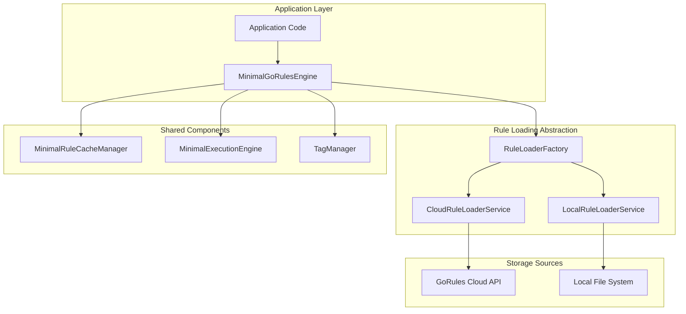
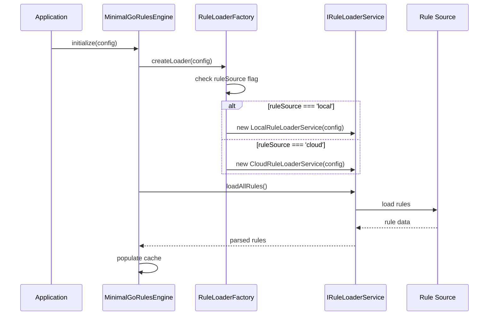

# Design Document

## Overview

The hybrid rule loading mechanism extends the existing Minimal GoRules Engine architecture to support both GoRules Cloud API and local file system rule loading. This design maintains the current high-performance characteristics while adding flexibility for offline development, faster testing, and deployment scenarios where local rule storage is preferred.

The solution introduces a new abstraction layer that allows seamless switching between rule sources without changing the existing API contracts. The design follows the existing architectural patterns and maintains backward compatibility.

## Architecture

### High-Level Architecture



### Component Interaction Flow



## Components and Interfaces

### 1. Enhanced Configuration Interface

```typescript
export interface MinimalGoRulesConfig {
  // Existing properties...
  apiUrl: string;
  apiKey: string;
  projectId: string;

  // New hybrid loading properties
  ruleSource?: 'cloud' | 'local'; // default: 'cloud'
  localRulesPath?: string; // required when ruleSource === 'local'
  enableHotReload?: boolean; // default: false, only for local rules
  metadataFilePattern?: string; // default: '*.meta.json'

  // File system options
  fileSystemOptions?: {
    recursive?: boolean; // default: true
    watchOptions?: {
      ignored?: string | RegExp | (string | RegExp)[];
      persistent?: boolean;
      ignoreInitial?: boolean;
    };
  };
}
```

### 2. Rule Loader Factory

```typescript
export interface IRuleLoaderFactory {
  createLoader(config: MinimalGoRulesConfig): IRuleLoaderService;
}

export class RuleLoaderFactory implements IRuleLoaderFactory {
  createLoader(config: MinimalGoRulesConfig): IRuleLoaderService {
    const ruleSource = config.ruleSource || 'cloud';

    switch (ruleSource) {
      case 'cloud':
        return new CloudRuleLoaderService(config);
      case 'local':
        return new LocalRuleLoaderService(config);
      default:
        throw new MinimalGoRulesError(`Invalid rule source: ${ruleSource}`);
    }
  }
}
```

### 3. Local Rule Loader Service

```typescript
export class LocalRuleLoaderService implements IRuleLoaderService {
  private readonly rulesPath: string;
  private readonly enableHotReload: boolean;
  private readonly fileWatcher?: FileWatcher;
  private readonly metadataPattern: string;

  constructor(config: MinimalGoRulesConfig) {
    // Initialize file system access and optional hot-reloading
  }

  async loadAllRules(): Promise<Map<string, { data: Buffer; metadata: MinimalRuleMetadata }>> {
    // Scan directory recursively for .json files
    // Load metadata from .meta.json files if present
    // Generate metadata from file stats if no .meta.json
  }

  async loadRule(ruleId: string): Promise<{ data: Buffer; metadata: MinimalRuleMetadata }> {
    // Load individual rule file
    // Handle nested directory structure (ruleId with path separators)
  }

  async checkVersions(rules: Map<string, string>): Promise<Map<string, boolean>> {
    // Compare file modification times with cached versions
  }
}
```

### 4. File System Utilities

```typescript
export interface FileSystemRule {
  id: string;
  filePath: string;
  data: Buffer;
  metadata: MinimalRuleMetadata;
}

export class FileSystemRuleScanner {
  async scanDirectory(basePath: string, options: FileSystemScanOptions): Promise<FileSystemRule[]> {
    // Cross-platform directory scanning
    // Handle recursive subdirectories
    // Generate rule IDs from file paths
  }

  async loadRuleFile(filePath: string): Promise<FileSystemRule> {
    // Load and validate JSON content
    // Load associated metadata file if exists
    // Generate default metadata from file stats
  }

  private generateRuleId(filePath: string, basePath: string): string {
    // Convert file path to rule ID (e.g., pricing/shipping-fees.json -> pricing/shipping-fees)
  }
}
```

### 5. Hot Reload Manager

```typescript
export interface IHotReloadManager {
  start(): Promise<void>;
  stop(): Promise<void>;
  onRuleChanged(callback: (ruleId: string, change: 'added' | 'modified' | 'deleted') => void): void;
}

export class HotReloadManager implements IHotReloadManager {
  private readonly watcher: FileWatcher;
  private readonly callbacks: Set<(ruleId: string, change: string) => void>;

  constructor(private readonly rulesPath: string, private readonly options: WatchOptions) {
    // Initialize file system watcher
  }

  async start(): Promise<void> {
    // Start watching for file changes
    // Debounce rapid changes
    // Emit change events
  }
}
```

## Data Models

### Local Rule Metadata File Format

```json
{
  "version": "1.0.0",
  "tags": ["pricing", "shipping"],
  "description": "Shipping fee calculation rules",
  "lastModified": "2024-01-15T10:30:00Z",
  "author": "development-team",
  "environment": "development"
}
```

### Directory Structure Examples

```
rules/
├── pricing/
│   ├── shipping-fees.json
│   ├── shipping-fees.meta.json
│   ├── discount-rules.json
│   └── discount-rules.meta.json
├── validation/
│   ├── order-validation.json
│   └── customer-validation.json
└── approval/
    ├── workflow-rules.json
    └── workflow-rules.meta.json
```

### Rule ID Mapping

- `pricing/shipping-fees.json` → Rule ID: `pricing/shipping-fees`
- `validation/order-validation.json` → Rule ID: `validation/order-validation`
- `approval/workflow-rules.json` → Rule ID: `approval/workflow-rules`

## Error Handling

### Configuration Validation

```typescript
export class ConfigValidator {
  static validateHybridConfig(config: MinimalGoRulesConfig): ConfigValidationResult {
    const errors: string[] = [];

    if (config.ruleSource === 'local') {
      if (!config.localRulesPath) {
        errors.push('localRulesPath is required when ruleSource is "local"');
      }

      if (config.localRulesPath && !this.isValidPath(config.localRulesPath)) {
        errors.push('localRulesPath must be a valid directory path');
      }
    }

    if (config.ruleSource === 'cloud') {
      if (!config.apiUrl || !config.apiKey || !config.projectId) {
        errors.push('apiUrl, apiKey, and projectId are required when ruleSource is "cloud"');
      }
    }

    return {
      isValid: errors.length === 0,
      errors,
    };
  }
}
```

### File System Error Handling

```typescript
export class FileSystemErrorHandler {
  static handleFileError(error: Error, filePath: string): MinimalGoRulesError {
    if (error.code === 'ENOENT') {
      return MinimalGoRulesError.ruleNotFound(`Rule file not found: ${filePath}`);
    }

    if (error.code === 'EACCES') {
      return MinimalGoRulesError.configurationError(`Permission denied: ${filePath}`);
    }

    if (error instanceof SyntaxError) {
      return MinimalGoRulesError.ruleValidationError(
        `Invalid JSON in ${filePath}: ${error.message}`,
      );
    }

    return MinimalGoRulesError.fileSystemError(`File system error for ${filePath}`, error);
  }
}
```

## Testing Strategy

### Unit Testing Approach

1. **Mock File System**: Use in-memory file system for testing local rule loading
2. **Configuration Testing**: Validate all configuration combinations
3. **Error Scenario Testing**: Test file system errors, permission issues, invalid JSON
4. **Hot Reload Testing**: Test file change detection and cache updates

### Integration Testing

1. **End-to-End Rule Loading**: Test complete flow from file system to rule execution
2. **Cross-Platform Testing**: Validate behavior on Windows, macOS, and Linux
3. **Performance Testing**: Compare local vs cloud loading performance
4. **Hot Reload Integration**: Test real file system changes with cache updates

### Test Structure

```typescript
describe('LocalRuleLoaderService', () => {
  describe('loadAllRules', () => {
    it('should load rules from directory structure');
    it('should handle nested directories');
    it('should load metadata from .meta.json files');
    it('should generate default metadata when .meta.json missing');
    it('should handle invalid JSON files gracefully');
  });

  describe('hot reload', () => {
    it('should detect file changes');
    it('should update cache on file modification');
    it('should handle file deletion');
    it('should debounce rapid changes');
  });
});
```

## Performance Considerations

### File System Optimization

1. **Batch File Operations**: Load multiple files in parallel where possible
2. **Efficient Directory Scanning**: Use native file system APIs for directory traversal
3. **Memory Management**: Stream large files instead of loading entirely into memory
4. **Caching Strategy**: Cache file metadata to avoid repeated stat calls

### Hot Reload Performance

1. **Debouncing**: Prevent excessive reloads during rapid file changes
2. **Selective Updates**: Only reload changed files, not entire rule set
3. **Background Processing**: Perform file watching in background threads
4. **Memory Efficiency**: Clean up file watchers and event listeners properly

### Cross-Platform Considerations

1. **Path Handling**: Use Node.js `path` module for cross-platform path operations
2. **File Watching**: Use `chokidar` library for reliable cross-platform file watching
3. **Permission Handling**: Gracefully handle different file system permissions
4. **Case Sensitivity**: Handle case-sensitive vs case-insensitive file systems

## Migration and Deployment

### Migration from Cloud to Local

1. **Export Utility**: Provide tool to download all cloud rules to local directory
2. **Metadata Preservation**: Maintain rule versions and tags during export
3. **Directory Structure**: Organize exported rules in logical directory structure

### Environment-Specific Configuration

```typescript
// Development - use local rules for fast iteration
const devConfig: MinimalGoRulesConfig = {
  ruleSource: 'local',
  localRulesPath: './rules',
  enableHotReload: true,
  // ... other config
};

// Production - use cloud rules for centralized management
const prodConfig: MinimalGoRulesConfig = {
  ruleSource: 'cloud',
  apiUrl: 'https://api.gorules.io',
  apiKey: process.env.GORULES_API_KEY,
  projectId: process.env.GORULES_PROJECT_ID,
  // ... other config
};
```

### Deployment Strategies

1. **Hybrid Deployment**: Use local rules for some environments, cloud for others
2. **Fallback Strategy**: Start with local rules, fallback to cloud if local unavailable
3. **Rule Synchronization**: Keep local rules in sync with cloud rules via CI/CD
4. **Version Management**: Use git or other VCS for local rule versioning
