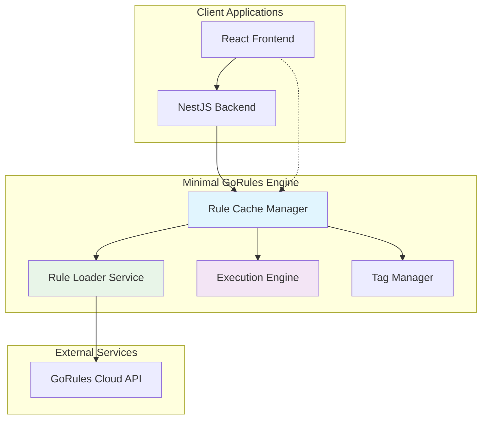
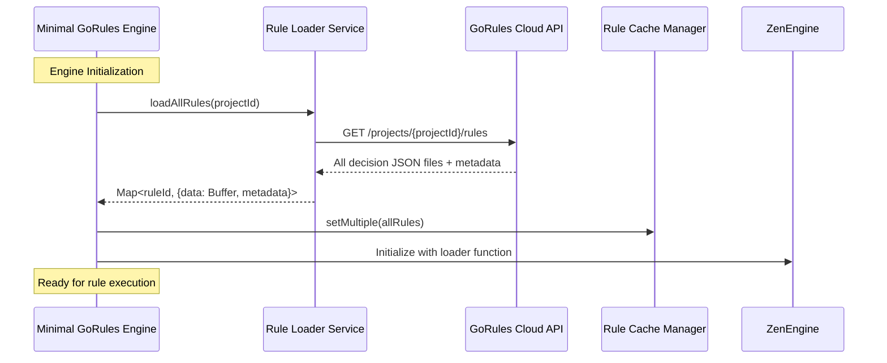
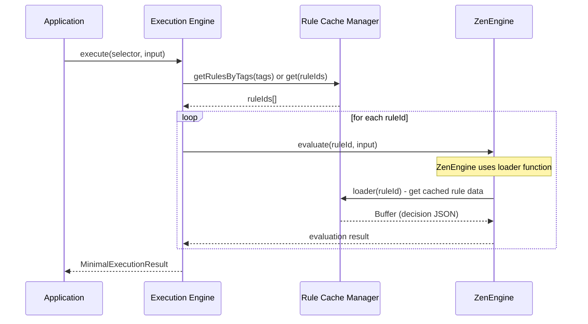

# Design Document

## Overview

The minimal high-performance GoRules engine is designed as a streamlined alternative to the existing comprehensive GoRules integration. This engine prioritizes performance, low latency, and minimal overhead while maintaining essential functionality for rule loading, caching, and execution. The design eliminates all non-essential features like circuit breakers, heavy logging, monitoring layers, and resilience services to achieve maximum performance.

### Key Design Principles

1. **Minimal Overhead**: Strip away all non-essential features that add runtime overhead
2. **Performance First**: Optimize for low latency and high throughput scenarios
3. **Memory Efficiency**: Minimize allocations and maintain lightweight cache structures
4. **Concurrency Safe**: Ensure thread-safe operations without performance penalties
5. **Cross-Platform**: Support both NestJS backend and React frontend deployment options

## Architecture

### High-Level Architecture



### Core Components

#### 1. Rule Cache Manager

- **Purpose**: Efficient in-memory caching with minimal overhead
- **Features**: LRU eviction, version tracking, atomic updates
- **Implementation**: Simple Map-based cache with read-write locks

#### 2. Rule Loader Service

- **Purpose**: Fetch ALL decision JSON files from GoRules Cloud project at startup
- **Features**: Project-wide rule loading, version detection, minimal HTTP client
- **Implementation**: Single API call to load entire project, then individual rule updates as needed

#### 3. Execution Engine

- **Purpose**: Execute rules with parallel/sequential modes
- **Features**: Input-driven execution modes, minimal Zen Engine wrapper
- **Implementation**: Direct ZenEngine integration with performance optimizations

#### 4. Tag Manager

- **Purpose**: Manage rule selection by tags and IDs
- **Features**: Fast tag lookup, rule grouping, dependency resolution
- **Implementation**: Optimized data structures for fast lookups

## Components and Interfaces

### Core Interfaces

```typescript
// Minimal rule metadata
interface MinimalRuleMetadata {
  id: string;
  version: string;
  tags: string[];
  lastModified: number; // timestamp for fast comparison
}

// Execution mode configuration
interface ExecutionMode {
  type: 'parallel' | 'sequential' | 'mixed';
  groups?: ExecutionGroup[]; // for mixed mode
}

interface ExecutionGroup {
  rules: string[];
  mode: 'parallel' | 'sequential';
}

// Rule selection criteria
interface RuleSelector {
  ids?: string[];
  tags?: string[];
  mode: ExecutionMode;
}

// Minimal execution result
interface MinimalExecutionResult<T = unknown> {
  results: Map<string, T>; // ruleId -> result
  executionTime: number;
  errors?: Map<string, Error>; // ruleId -> error
}
```

### Service Interfaces

```typescript
interface IRuleCacheManager {
  // Cache operations
  get(ruleId: string): Buffer | null;
  set(ruleId: string, data: Buffer, metadata: MinimalRuleMetadata): void;
  getMetadata(ruleId: string): MinimalRuleMetadata | null;

  // Bulk operations
  getMultiple(ruleIds: string[]): Map<string, Buffer>;
  setMultiple(rules: Map<string, { data: Buffer; metadata: MinimalRuleMetadata }>): void;

  // Tag operations
  getRulesByTags(tags: string[]): string[];

  // Version management
  isVersionCurrent(ruleId: string, version: string): boolean;
  invalidate(ruleId: string): void;
  clear(): void;
}

interface IRuleLoaderService {
  // Project-wide loading (primary method - called at startup)
  loadAllRules(
    projectId: string,
  ): Promise<Map<string, { data: Buffer; metadata: MinimalRuleMetadata }>>;

  // Individual rule loading (for updates)
  loadRule(ruleId: string): Promise<{ data: Buffer; metadata: MinimalRuleMetadata }>;

  // Version management
  checkVersions(rules: Map<string, string>): Promise<Map<string, boolean>>; // ruleId -> needsUpdate
  refreshRule(ruleId: string): Promise<{ data: Buffer; metadata: MinimalRuleMetadata }>;
}

interface IExecutionEngine {
  // Core execution
  execute<T>(
    selector: RuleSelector,
    input: Record<string, unknown>,
  ): Promise<MinimalExecutionResult<T>>;

  // Single rule execution
  executeRule<T>(ruleId: string, input: Record<string, unknown>): Promise<T>;

  // Validation
  validateRule(ruleId: string): Promise<boolean>;
}
```

## Data Models

### Rule Cache Structure

```typescript
class RuleCache {
  private rules: Map<string, Buffer> = new Map();
  private metadata: Map<string, MinimalRuleMetadata> = new Map();
  private tagIndex: Map<string, Set<string>> = new Map(); // tag -> ruleIds
  private accessTimes: Map<string, number> = new Map();
  private readonly maxSize: number;
  private readonly lock: ReadWriteLock; // Simple read-write lock implementation
}
```

### Configuration Model

```typescript
interface MinimalGoRulesConfig {
  // Required
  apiUrl: string;
  apiKey: string;
  projectId: string;

  // Optional performance settings
  cacheMaxSize?: number; // default: 1000
  httpTimeout?: number; // default: 5000ms
  batchSize?: number; // default: 50

  // Cross-platform settings
  platform?: 'node' | 'browser';
}
```

## Error Handling

### Minimal Error Types

```typescript
enum MinimalErrorCode {
  RULE_NOT_FOUND = 'RULE_NOT_FOUND',
  NETWORK_ERROR = 'NETWORK_ERROR',
  TIMEOUT = 'TIMEOUT',
  INVALID_INPUT = 'INVALID_INPUT',
  EXECUTION_ERROR = 'EXECUTION_ERROR',
}

class MinimalGoRulesError extends Error {
  constructor(
    public readonly code: MinimalErrorCode,
    message: string,
    public readonly ruleId?: string,
  ) {
    super(message);
    this.name = 'MinimalGoRulesError';
  }
}
```

### Error Handling Strategy

1. **Fail Fast**: No retry logic or circuit breakers - fail immediately on errors
2. **Minimal Context**: Only essential error information to reduce overhead
3. **Batch Resilience**: Continue processing other rules if one fails in batch execution
4. **Silent Degradation**: Log errors minimally, focus on performance

## Testing Strategy

### Unit Testing Approach

```typescript
// Mock-based testing for isolated components
describe('RuleCacheManager', () => {
  it('should cache rules efficiently', () => {
    // Test cache operations with performance assertions
  });

  it('should handle LRU eviction correctly', () => {
    // Test memory management
  });
});

describe('ExecutionEngine', () => {
  it('should execute rules in parallel mode', () => {
    // Test parallel execution with timing assertions
  });

  it('should execute rules in sequential mode', () => {
    // Test sequential execution order
  });
});
```

### Performance Testing

```typescript
// Benchmark tests for performance validation
describe('Performance Tests', () => {
  it('should execute 1000 rules under 100ms', async () => {
    const startTime = performance.now();
    await engine.execute(selector, input);
    const duration = performance.now() - startTime;
    expect(duration).toBeLessThan(100);
  });

  it('should maintain memory usage under 50MB', () => {
    // Memory usage assertions
  });
});
```

### Integration Testing

```typescript
// Real GoRules Cloud API integration tests
describe('Integration Tests', () => {
  it('should load rules from GoRules Cloud', async () => {
    // Test actual API integration
  });

  it('should handle version updates correctly', async () => {
    // Test version detection and cache updates
  });
});
```

## Implementation Details

### Rule Loading and Execution Flow

#### Initial Project Loading (Startup)



#### Rule Execution Flow



### Execution Modes Implementation

```typescript
class ExecutionEngine {
  private zenEngine: ZenEngine;

  constructor(private cacheManager: IRuleCacheManager) {
    // Initialize ZenEngine with loader function that uses our cache
    this.zenEngine = new ZenEngine({
      loader: async (ruleId: string) => {
        const ruleData = this.cacheManager.get(ruleId);
        if (!ruleData) {
          throw new MinimalGoRulesError(
            MinimalErrorCode.RULE_NOT_FOUND,
            `Rule not found: ${ruleId}`,
            ruleId,
          );
        }
        return ruleData; // Return cached Buffer containing decision JSON
      },
    });
  }

  async execute<T>(
    selector: RuleSelector,
    input: Record<string, unknown>,
  ): Promise<MinimalExecutionResult<T>> {
    const ruleIds = this.resolveRules(selector);

    switch (selector.mode.type) {
      case 'parallel':
        return this.executeParallel(ruleIds, input);
      case 'sequential':
        return this.executeSequential(ruleIds, input);
      case 'mixed':
        return this.executeMixed(ruleIds, input, selector.mode.groups);
    }
  }

  private async executeParallel<T>(
    ruleIds: string[],
    input: Record<string, unknown>,
  ): Promise<MinimalExecutionResult<T>> {
    const promises = ruleIds.map(
      (ruleId) => this.zenEngine.evaluate(ruleId, input), // ZenEngine.evaluate uses our loader function
    );

    const results = await Promise.allSettled(promises);
    return this.processResults(results, ruleIds);
  }

  private async executeSequential<T>(
    ruleIds: string[],
    input: Record<string, unknown>,
  ): Promise<MinimalExecutionResult<T>> {
    const results = new Map<string, T>();
    const errors = new Map<string, Error>();
    let currentInput = { ...input };

    for (const ruleId of ruleIds) {
      try {
        const result = await this.zenEngine.evaluate(ruleId, currentInput);
        results.set(ruleId, result.result);
        // Update input with result for next rule (pipeline mode)
        currentInput = { ...currentInput, ...result.result };
      } catch (error) {
        errors.set(ruleId, error as Error);
      }
    }

    return { results, errors, executionTime: 0 }; // timing implementation omitted for brevity
  }

  async executeRule<T>(ruleId: string, input: Record<string, unknown>): Promise<T> {
    const result = await this.zenEngine.evaluate(ruleId, input);
    return result.result;
  }
}
```

### Cross-Platform Deployment

#### NestJS Integration

```typescript
@Module({
  providers: [
    {
      provide: 'MINIMAL_GORULES_CONFIG',
      useValue: {
        apiUrl: process.env.GORULES_API_URL,
        apiKey: process.env.GORULES_API_KEY,
        projectId: process.env.GORULES_PROJECT_ID,
        platform: 'node',
      },
    },
    MinimalGoRulesEngine,
  ],
  exports: [MinimalGoRulesEngine],
})
export class MinimalGoRulesModule {}
```

#### React Integration Options

**Option 1: API-based (Recommended)**

```typescript
// React service that calls NestJS backend
class ReactGoRulesService {
  async executeRules(selector: RuleSelector, input: Record<string, unknown>) {
    const response = await fetch('/api/rules/execute', {
      method: 'POST',
      headers: { 'Content-Type': 'application/json' },
      body: JSON.stringify({ selector, input }),
    });
    return response.json();
  }
}
```

**Option 2: Direct Client-side (Future)**

```typescript
// Direct browser integration (requires WebAssembly compilation)
import { MinimalGoRulesEngine } from '@minimal-gorules/browser';

const engine = new MinimalGoRulesEngine({
  apiUrl: process.env.REACT_APP_GORULES_API_URL,
  apiKey: process.env.REACT_APP_GORULES_API_KEY,
  projectId: process.env.REACT_APP_GORULES_PROJECT_ID,
  platform: 'browser',
});
```

## Performance Optimizations

### Memory Management

- Use `Buffer` for rule storage to minimize memory overhead
- Implement efficient LRU eviction with O(1) operations
- Avoid object creation in hot paths
- Use `Map` and `Set` for O(1) lookups

### Concurrency Optimizations

- Read-write locks for cache access (multiple readers, single writer)
- Lock-free operations where possible
- Minimize critical sections
- Use `Promise.allSettled` for parallel execution without blocking

### Network Optimizations

- HTTP/2 connection reuse
- Request batching for multiple rules
- Minimal HTTP client without heavy abstractions
- Compression for rule data transfer

### Execution Optimizations

- Direct ZenEngine integration without middleware layers
- Minimal result object creation
- Fast-path for cached rules
- Avoid JSON serialization in hot paths

This design provides a solid foundation for implementing a minimal, high-performance GoRules engine that meets all the specified requirements while maintaining clean architecture and cross-platform compatibility.
