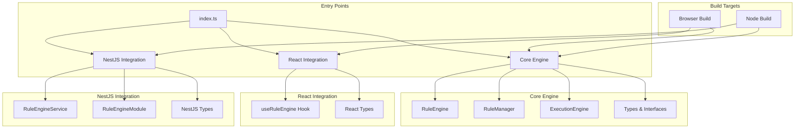
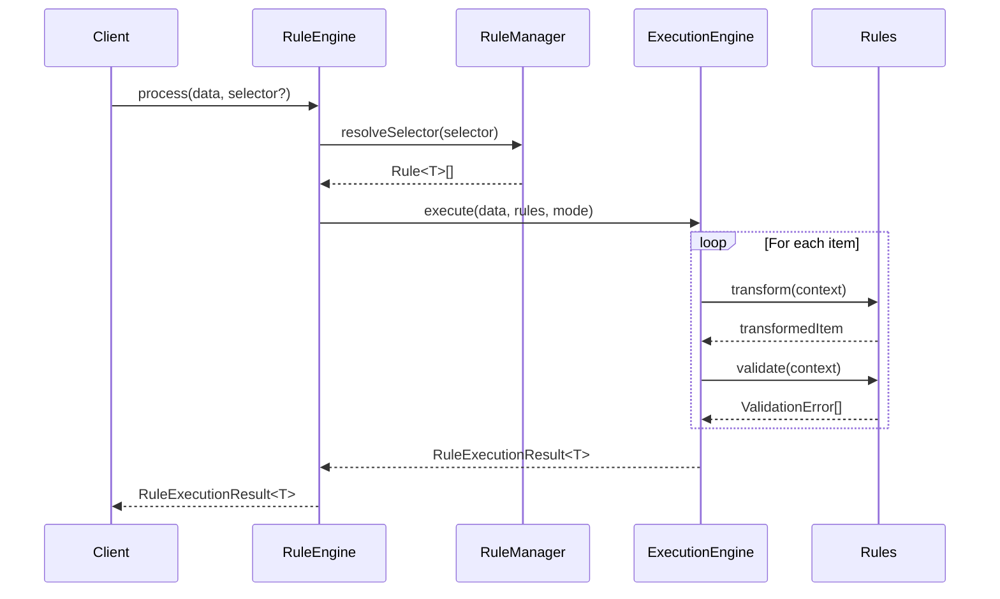
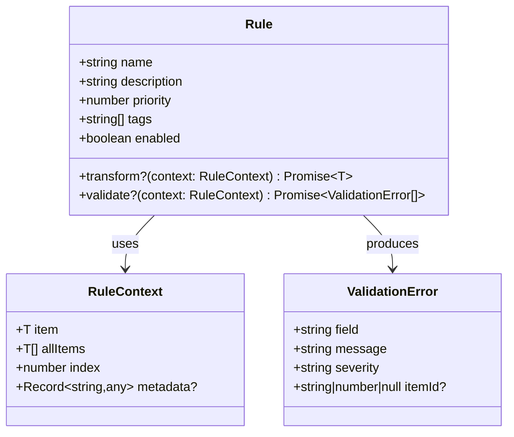
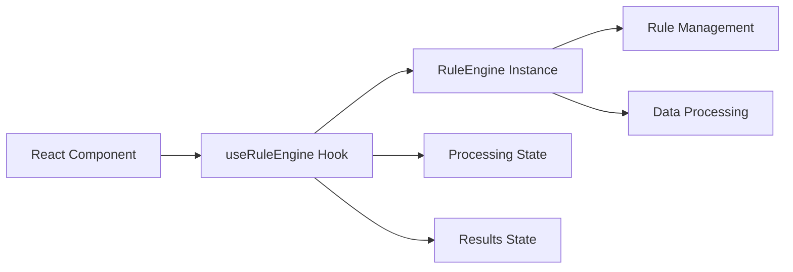
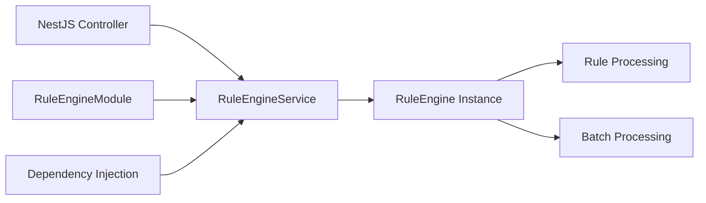
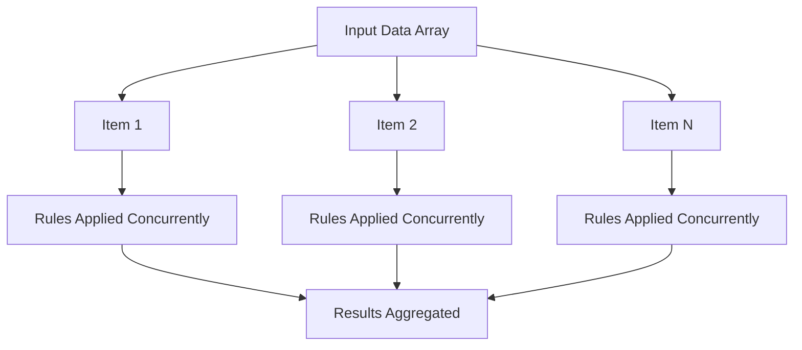
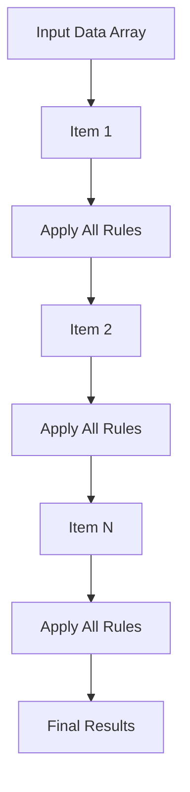
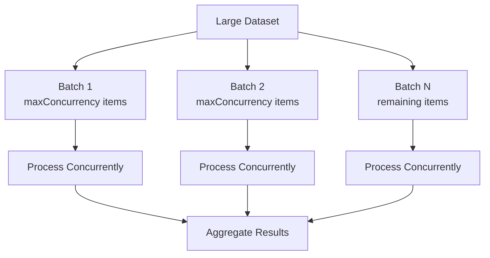
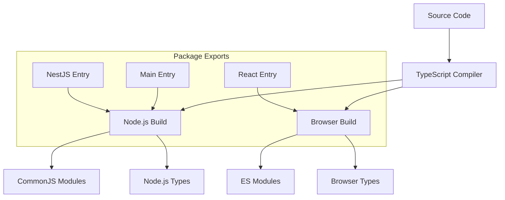

# CM Rule Engine - Architecture Overview

## 🏗️ High-Level Architecture

The `cm-rule-engine` is a flexible, type-safe rule engine designed for data transformation and validation with zero dependencies in its core. It follows a modular architecture with clear separation of concerns.



## 🔧 Core Components

### 1. RuleEngine (Main Orchestrator)
**Location**: `src/lib/core/rule-engine.ts`

The main entry point that coordinates rule management and execution.

```typescript
class RuleEngine<T> {
  - ruleManager: RuleManager<T>
  - executionEngine: ExecutionEngine<T>
  
  + addRule(rule: Rule<T>): void
  + removeRule(name: string): void
  + process(data: T[], mode?: ExecutionMode): Promise<RuleExecutionResult<T>>
  + processWithRules(data: T[], selector: RuleSelector): Promise<RuleExecutionResult<T>>
  + processBatch(data: T[], selector: RuleSelector, options?: BatchOptions): Promise<RuleExecutionResult<T>>
}
```

### 2. RuleManager (Rule Registry)
**Location**: `src/lib/core/rule-manager.ts`

Manages rule registration, organization, and retrieval with O(1) tag-based lookups.

```typescript
class RuleManager<T> {
  - rules: Map<string, Rule<T>>
  - tagIndex: Map<string, Set<string>>
  
  + addRule(rule: Rule<T>): void
  + removeRule(name: string): void
  + getEnabledRules(): Rule<T>[]
  + getRulesByTags(tags: string[]): Rule<T>[]
  + resolveSelector(selector: RuleSelector): Rule<T>[]
}
```

### 3. ExecutionEngine (Rule Execution)
**Location**: `src/lib/core/execution-engine.ts`

Handles rule execution with different strategies (parallel/sequential) and batch processing.

```typescript
class ExecutionEngine<T> {
  + execute(data: T[], rules: Rule<T>[], mode: ExecutionMode): Promise<RuleExecutionResult<T>>
  + executeBatch(data: T[], rules: Rule<T>[], options: BatchOptions): Promise<RuleExecutionResult<T>>
  - executeParallel(data: T[], rules: Rule<T>[]): Promise<RuleExecutionResult<T>>
  - executeSequential(data: T[], rules: Rule<T>[]): Promise<RuleExecutionResult<T>>
  - processItem(item: T, index: number, allItems: T[], rules: Rule<T>[], mode: ExecutionMode): Promise<BatchItemResult<T>>
}
```

## 📊 Data Flow Architecture



## 🎯 Rule Structure



## 🔌 Integration Architecture

### React Integration
**Location**: `src/lib/react/`



**Key Features**:
- `useRuleEngine<T>()` hook for React components
- State management for processing status and results
- Memoized engine instance for performance
- Callback-based API for rule management

### NestJS Integration
**Location**: `src/lib/nestjs/`



**Key Features**:
- `RuleEngineService` as injectable service
- `RuleEngineModule` for module configuration
- Support for initial rule registration via DI
- Full async/await support for NestJS patterns

## 🚀 Execution Modes

### Parallel Execution


### Sequential Execution


### Batch Processing


## 📦 Build Architecture

The library supports multiple build targets:



## 🎨 Design Patterns Used

1. **Strategy Pattern**: Different execution modes (parallel/sequential)
2. **Observer Pattern**: Rule registration and management
3. **Factory Pattern**: Rule engine creation and configuration
4. **Facade Pattern**: Main RuleEngine class simplifies complex interactions
5. **Dependency Injection**: NestJS integration with IoC container
6. **Hook Pattern**: React integration with custom hooks

## 🔍 Key Features

- **Zero Dependencies**: Core engine has no external dependencies
- **Type Safety**: Full TypeScript support with generics
- **Performance**: O(1) tag-based rule lookup, parallel execution
- **Flexibility**: Support for both transformation and validation rules
- **Integration Ready**: Built-in React and NestJS integrations
- **Batch Processing**: Controlled concurrency for large datasets
- **Error Handling**: Comprehensive error types and graceful failure handling

## 📈 Performance Characteristics

- **Rule Lookup**: O(1) for tag-based selection via hash maps
- **Execution**: Configurable parallel/sequential modes
- **Memory**: Efficient batch processing with controlled concurrency
- **Scalability**: Designed for large datasets with batch processing options

This architecture provides a solid foundation for building complex rule-based systems while maintaining flexibility and performance.