# Minimal GoRules Engine - Architecture Guide

This guide explains how the minimal-gorules library works, designed to help developers — especially new team members — quickly understand the overall flow and architecture so they can easily work with it.

## 🚀 Quick Start Flow

Here's how developers typically use the library:

```typescript
// 1. Create and initialize the engine
const engine = new MinimalGoRulesEngine({
  apiUrl: 'https://api.gorules.io',
  apiKey: 'your-api-key',
  projectId: 'your-project-id',
});

await engine.initialize(); // Loads all rules into cache

// 2. Execute rules
const result = await engine.executeRule('shipping-calculator', {
  weight: 2.5,
  destination: 'US',
});

console.log(result); // { fee: 15.99, estimatedDays: 5 }
```

## 🏗️ High-Level Architecture

The library consists of 5 main components that work together:


## 🔧 Core Components Explained

### 1. MinimalGoRulesEngine (The Main Controller)

This is what you interact with directly. It coordinates everything else.

**What it does:**

- Validates your configuration
- Initializes all other components
- Provides the main API methods you use
- Handles errors and status reporting

**Key methods you'll use:**

```typescript
await engine.initialize(); // Load all rules at startup
await engine.executeRule(id, data); // Execute one rule
await engine.executeRules([ids], data); // Execute multiple rules
await engine.executeByTags(['tag'], data); // Execute by tags
await engine.refreshCache(); // Update outdated rules
```

### 2. MinimalRuleCacheManager (Smart Storage)

Keeps rules in memory for fast access using an LRU (Least Recently Used) cache.

**What it does:**

- Stores rules in memory for instant access
- Automatically removes old rules when memory is full
- Indexes rules by tags for quick discovery
- Thread-safe with read/write locks

**Why it matters:** Rules load in milliseconds instead of making API calls every time.

### 3. MinimalRuleLoaderService (API Communication)

Handles all communication with GoRules Cloud API.

**What it does:**

- Loads all project rules during initialization
- Checks for rule version updates
- Downloads individual rules when needed
- Handles network errors and retries

**Two versions available:**

- **Basic**: Simple HTTP client
- **Enhanced**: Adds connection pooling, request batching, compression

### 4. MinimalExecutionEngine (Rule Runner)

Wraps ZenEngine to execute business rules with different strategies.

**Execution modes:**

- **Single rule**: `executeRule('rule-id', data)`
- **Parallel**: Multiple rules run simultaneously
- **Sequential**: Rules run one after another
- **Mixed**: Combine parallel and sequential in groups

### 5. TagManager (Rule Discovery)

Helps find rules by tags instead of remembering specific rule IDs.

**What it does:**

- Resolves tags like `['pricing', 'shipping']` to actual rule IDs
- Validates that requested rules exist
- Optimizes execution order

## 🔄 How It All Works Together

### Complete Flow: From Your Code to Rule Result

```mermaid
sequenceDiagram
    participant You as Your Application
    participant Engine as MinimalGoRulesEngine
    participant Cache as Cache Manager
    participant Loader as Rule Loader
    participant Execution as Execution Engine
    participant API as GoRules API
    participant Zen as ZenEngine

    Note over You,Zen: 1. INITIALIZATION (happens once)
    You->>Engine: new MinimalGoRulesEngine(config)
    Engine->>Engine: Validate config
    Engine->>Cache: Create cache
    Engine->>Loader: Create loader
    Engine->>Execution: Create execution engine

    You->>Engine: await engine.initialize()
    Engine->>Loader: loadAllRules(projectId)
    Loader->>API: GET /projects/{id}/rules
    API-->>Loader: All project rules
    Loader-->>Engine: Rules with metadata
    Engine->>Cache: Store all rules
    Engine-->>You: ✅ Engine ready

    Note over You,Zen: 2. RULE EXECUTION (happens many times)
    You->>Engine: executeRule('shipping-calc', data)
    Engine->>Cache: get('shipping-calc')

    alt Rule in cache
        Cache-->>Engine: Rule data
    else Rule not in cache (rare)
        Engine->>Loader: loadRule('shipping-calc')
        Loader->>API: GET /rules/shipping-calc
        API-->>Loader: Rule data
        Loader-->>Engine: Rule data
        Engine->>Cache: Store rule
    end

    Engine->>Execution: executeRule('shipping-calc', data)
    Execution->>Zen: Execute business logic
    Zen-->>Execution: Result
    Execution-->>Engine: Result with metrics
    Engine-->>You: ✅ Final result
```




### Engine Initialization: What Happens When You Call `initialize()`

```mermaid
flowchart TD
    START["engine.initialize()"] --> VALIDATE[Validate Configuration]
    VALIDATE --> CREATE[Create All Components]

    CREATE --> CACHE[Create Cache Manager<br/>LRU cache with tag indexing]
    CREATE --> LOADER[Create Rule Loader<br/>HTTP client for API calls]
    CREATE --> EXEC[Create Execution Engine<br/>ZenEngine wrapper]
    CREATE --> TAG[Create Tag Manager<br/>Rule discovery system]
    CREATE --> VERSION[Create Version Manager<br/>Update tracking]

    CACHE --> LOAD[Load All Project Rules]
    LOADER --> LOAD
    EXEC --> LOAD
    TAG --> LOAD
    VERSION --> LOAD

    LOAD --> API_CALL["loader.loadAllRules()"]
    API_CALL --> FETCH[Fetch from GoRules API]
    FETCH --> STORE[Store in Cache]
    STORE --> INDEX[Build Tag Index]
    INDEX --> READY[✅ Engine Ready]

    VALIDATE -->|Invalid Config| ERROR[❌ Throw Error]
    FETCH -->|Network Error| ERROR

    style START fill:#e3f2fd
    style READY fill:#c8e6c9
    style ERROR fill:#ffcdd2

```

`.png>)



### Rule Execution Modes: How Different Execution Types Work


## �️ Commponent Relationships

### How Components Connect and Communicate

```mermaid
graph TB
    subgraph "Your Application Layer"
        APP[Your Code]
        NEST[NestJS Service]
        REACT[React Hooks]
    end

    subgraph "Main Engine"
        ENGINE[MinimalGoRulesEngine<br/>• Orchestrates everything<br/>• Validates config<br/>• Provides main API]
    end

    subgraph "Core Services"
        CACHE[Cache Manager<br/>• LRU cache<br/>• Tag indexing<br/>• Thread-safe]

        LOADER[Rule Loader<br/>• API communication<br/>• Version checking<br/>• Error handling]

        EXECUTION[Execution Engine<br/>• ZenEngine wrapper<br/>• Parallel/Sequential<br/>• Performance metrics]

        TAGS[Tag Manager<br/>• Tag → Rule ID mapping<br/>• Rule discovery<br/>• Validation]

        VERSION[Version Manager<br/>• Update detection<br/>• Cache invalidation<br/>• Rollback support]
    end

    subgraph "Performance Layer (Optional)"
        MEMORY[Memory Manager<br/>• Usage monitoring<br/>• Cleanup triggers<br/>• Threshold alerts]

        POOL[Connection Pool<br/>• HTTP reuse<br/>• Request queuing<br/>• Retry logic]

        BATCH[Request Batcher<br/>• Combine API calls<br/>• Reduce latency<br/>• Handle failures]
    end

    subgraph "External"
        API[GoRules Cloud API]
        ZEN[ZenEngine Library]
    end

    APP --> ENGINE
    NEST --> ENGINE
    REACT --> ENGINE

    ENGINE --> CACHE
    ENGINE --> LOADER
    ENGINE --> EXECUTION
    ENGINE --> TAGS
    ENGINE --> VERSION

    LOADER --> POOL
    LOADER --> BATCH
    CACHE --> MEMORY

    LOADER --> API
    EXECUTION --> ZEN
    EXECUTION --> CACHE
    TAGS --> CACHE
    VERSION --> CACHE
    VERSION --> LOADER

    style ENGINE fill:#e1f5fe
    style CACHE fill:#f3e5f5
    style EXECUTION fill:#e8f5e8
    style LOADER fill:#fff3e0
```




## 🚀 Common Usage Patterns

### 1. Basic Setup (Most Common)

```typescript
// Create and initialize the engine
const engine = new MinimalGoRulesEngine({
  apiUrl: 'https://api.gorules.io',
  apiKey: 'your-api-key',
  projectId: 'your-project-id',
  cacheMaxSize: 1000, // Optional: default is 1000 rules
});

// Initialize once at application startup
await engine.initialize();

// Execute rules throughout your application
const shippingResult = await engine.executeRule('shipping-calculator', {
  weight: 2.5,
  destination: 'US',
  priority: 'standard',
});

console.log(shippingResult); // { fee: 15.99, estimatedDays: 5 }
```

### 2. Multiple Rules Execution

```typescript
// Execute specific rules in parallel
const results = await engine.executeRules(['shipping-calc', 'tax-calc', 'discount-calc'], {
  amount: 100,
  destination: 'US',
  customerType: 'premium',
});

// Results is a Map: ruleId -> result
console.log(results.results.get('shipping-calc')); // { fee: 15.99 }
console.log(results.results.get('tax-calc')); // { tax: 8.25 }
```

### 3. Tag-Based Execution

```typescript
// Execute all rules tagged with 'pricing'
const pricingResults = await engine.executeByTags(
  ['pricing', 'validation'],
  { product: 'laptop', price: 999 },
  'parallel', // or 'sequential'
);

// Process results
for (const [ruleId, result] of pricingResults.results) {
  console.log(`${ruleId}:`, result);
}
```

### 4. Advanced Execution with Custom Selector

```typescript
// Complex execution scenarios
const results = await engine.execute(
  {
    ids: ['validation-rule'], // Specific rules
    tags: ['pricing'], // Plus rules with tags
    mode: {
      type: 'mixed',
      groups: [
        { rules: ['validation-rule'], mode: 'sequential' },
        { rules: ['pricing-rules'], mode: 'parallel' },
      ],
    },
  },
  inputData,
);
```

### 5. Cache Management

```typescript
// Check which rules need updates
const versionCheck = await engine.checkVersions();
console.log('Outdated rules:', versionCheck.outdatedRules);

// Refresh outdated rules
const refreshResult = await engine.refreshCache();
console.log('Refreshed:', refreshResult.refreshedRules);

// Force refresh specific rules
await engine.refreshCache(['shipping-calc', 'tax-calc']);

// Get engine status
const status = await engine.getStatus();
console.log(`Engine has ${status.rulesLoaded} rules loaded`);
```

### 6. NestJS Integration

```typescript
// app.module.ts
import { MinimalGoRulesModule } from '@your-org/minimal-gorules';

@Module({
  imports: [
    MinimalGoRulesModule.forRoot({
      apiUrl: process.env.GORULES_API_URL,
      apiKey: process.env.GORULES_API_KEY,
      projectId: process.env.GORULES_PROJECT_ID,
    }),
  ],
})
export class AppModule {}

// business.service.ts
@Injectable()
export class BusinessService {
  constructor(private goRules: MinimalGoRulesService) {}

  async calculateShipping(order: Order) {
    return await this.goRules.executeRule('shipping-calculator', order);
  }
}
```

### 7. React Integration

```typescript
// App.tsx - Setup provider
import { MinimalGoRulesProvider } from '@your-org/minimal-gorules/react';

function App() {
  return (
    <MinimalGoRulesProvider
      config={{
        apiUrl: process.env.REACT_APP_GORULES_API_URL,
        apiKey: process.env.REACT_APP_GORULES_API_KEY,
        projectId: process.env.REACT_APP_GORULES_PROJECT_ID,
      }}
    >
      <OrderForm />
    </MinimalGoRulesProvider>
  );
}

// OrderForm.tsx - Use hooks
function OrderForm() {
  const { executeRule, loading, error } = useRuleExecution();
  const [result, setResult] = useState(null);

  const handleSubmit = async (formData) => {
    const shippingResult = await executeRule('shipping-calculator', formData);
    setResult(shippingResult);
  };

  return (
    <form onSubmit={handleSubmit}>
      {/* form fields */}
      {loading && <div>Calculating...</div>}
      {error && <div>Error: {error.message}</div>}
      {result && <div>Shipping: ${result.fee}</div>}
    </form>
  );
}
```

### 8. Performance Optimizations

```typescript
// Enable performance features
const engine = new MinimalGoRulesEngine({
  apiUrl: 'https://api.gorules.io',
  apiKey: 'your-api-key',
  projectId: 'your-project-id',

  // Performance options
  enablePerformanceOptimizations: true,
  memoryWarningThreshold: 0.7, // Warn at 70% memory
  memoryCriticalThreshold: 0.85, // Critical at 85% memory
  batchSize: 100, // Batch API requests
  httpTimeout: 10000, // 10 second timeout
});
```

## ⚙️ Configuration Guide

### Required Configuration

```typescript
interface MinimalGoRulesConfig {
  // Required - GoRules Cloud API settings
  apiUrl: string; // Usually 'https://api.gorules.io'
  apiKey: string; // Your API key from GoRules dashboard
  projectId: string; // Your project ID from GoRules dashboard

  // Optional - Cache settings
  cacheMaxSize?: number; // Default: 1000 rules

  // Optional - Performance settings
  enablePerformanceOptimizations?: boolean; // Default: false
  batchSize?: number; // Default: 50
  httpTimeout?: number; // Default: 5000ms

  // Optional - Memory management (when performance optimizations enabled)
  memoryWarningThreshold?: number; // Default: 0.7 (70%)
  memoryCriticalThreshold?: number; // Default: 0.85 (85%)
}
```

### Configuration Examples

```typescript
// Basic configuration
const basicConfig = {
  apiUrl: 'https://api.gorules.io',
  apiKey: 'your-api-key',
  projectId: 'your-project-id',
};

// Production configuration with optimizations
const productionConfig = {
  apiUrl: 'https://api.gorules.io',
  apiKey: process.env.GORULES_API_KEY,
  projectId: process.env.GORULES_PROJECT_ID,
  cacheMaxSize: 2000,
  enablePerformanceOptimizations: true,
  batchSize: 100,
  httpTimeout: 10000,
  memoryWarningThreshold: 0.75,
  memoryCriticalThreshold: 0.9,
};
```

### Configuration Validation

The engine automatically validates your configuration and will throw helpful errors:

```typescript
try {
  const engine = new MinimalGoRulesEngine(config);
} catch (error) {
  // Will catch issues like:
  // - Missing required fields (apiUrl, apiKey, projectId)
  // - Invalid URLs
  // - Invalid threshold values
  console.error('Configuration error:', error.message);
}
```

## 🔄 Cache and Memory Management

### How the Cache Works

The library uses an intelligent caching system to keep rules in memory for fast access: 


### Memory Management (When Performance Optimizations Enabled)

```mermaid
flowchart TD
    MONITOR[Memory Monitor<br/>Checks every 5 seconds] --> CHECK{Memory Usage?}

    CHECK -->|< 70%| NORMAL[✅ Normal Operation<br/>All systems go]
    CHECK -->|70-85%| WARNING[⚠️ Warning State<br/>Start cleanup]
    CHECK -->|> 85%| CRITICAL[🚨 Critical State<br/>Aggressive cleanup]

    WARNING --> REDUCE[Reduce cache size by 20%]
    WARNING --> LOG_WARN[Log warning message]

    CRITICAL --> FORCE_GC[Force garbage collection]
    CRITICAL --> AGGRESSIVE[Remove 50% of cached rules]
    CRITICAL --> LOG_CRIT[Log critical message]

    REDUCE --> MONITOR
    AGGRESSIVE --> MONITOR
    NORMAL --> MONITOR

    style NORMAL fill:#c8e6c9
    style WARNING fill:#fff3e0
    style CRITICAL fill:#ffcdd2
```




### Cache Behavior Examples

```typescript
// Cache hit (fast) - rule already in memory
const result1 = await engine.executeRule('shipping-calc', data); // ~1ms

// Cache miss (slower) - rule needs to be loaded
const result2 = await engine.executeRule('new-rule', data); // ~100ms

// Subsequent calls are fast again
const result3 = await engine.executeRule('new-rule', data); // ~1ms
```

## ⚡ Performance Features

### Built-in Optimizations

The library includes several performance optimizations that work automatically:

```mermaid
graph TB
    subgraph "Always Active"
        CACHE[In-Memory LRU Cache<br/>• O(1) rule lookup<br/>• Automatic eviction<br/>• Tag-based indexing]

        PARALLEL[Parallel Execution<br/>• Multiple rules simultaneously<br/>• CPU core utilization<br/>• Configurable concurrency]
    end

    subgraph "Optional (enablePerformanceOptimizations: true)"
        POOL[Connection Pooling<br/>• Reuse HTTP connections<br/>• Reduce connection overhead<br/>• Queue management]

        BATCH[Request Batching<br/>• Combine API calls<br/>• Reduce network round trips<br/>• Handle partial failures]

        MEMORY[Memory Management<br/>• Monitor memory usage<br/>• Automatic cleanup<br/>• Prevent memory leaks]

        COMPRESS[Compression<br/>• Compress cached rules<br/>• Reduce memory footprint<br/>• Faster serialization]
    end

    style CACHE fill:#e3f2fd
    style PARALLEL fill:#e8f5e8
    style POOL fill:#fff3e0
    style BATCH fill:#f3e5f5
    style MEMORY fill:#ffecb3
    style COMPRESS fill:#e1f5fe
```

### Performance Comparison

| Feature                 | Without Optimizations | With Optimizations   |
| ----------------------- | --------------------- | -------------------- |
| Rule execution          | ~1-5ms                | ~1-3ms               |
| Cache memory usage      | 100%                  | ~60% (compressed)    |
| API calls for 100 rules | 100 requests          | ~10 batched requests |
| Memory cleanup          | Manual                | Automatic            |
| Connection overhead     | High                  | Low (pooled)         |

### When to Enable Performance Optimizations

```typescript
// Enable for production applications with:
const config = {
  // ... basic config
  enablePerformanceOptimizations: true, // Enable when you have:
};

// ✅ Good candidates:
// - High-volume applications (>1000 rule executions/minute)
// - Memory-constrained environments
// - Applications with many different rules
// - Long-running processes

// ❌ Skip for:
// - Simple applications with few rules
// - Development/testing environments
// - Applications that execute rules infrequently
```

## 🔌 Platform Support

### Available Integrations

The library works across different platforms and frameworks:


### Import Paths

```typescript
// Core engine (works everywhere)
import { MinimalGoRulesEngine } from '@your-org/minimal-gorules';

// NestJS integration
import { MinimalGoRulesModule, MinimalGoRulesService } from '@your-org/minimal-gorules/nestjs';

// React integration
import { MinimalGoRulesProvider, useRuleExecution } from '@your-org/minimal-gorules/react';

// Browser-specific build (smaller bundle)
import { MinimalGoRulesEngine } from '@your-org/minimal-gorules/browser';

// Node.js-specific build (with performance optimizations)
import { MinimalGoRulesEngine } from '@your-org/minimal-gorules/node';
```

## 📊 Monitoring and Debugging

### Built-in Status and Metrics

```typescript
// Get engine status
const status = await engine.getStatus();
console.log(status);
// {
//   initialized: true,
//   rulesLoaded: 150,
//   lastUpdate: 1640995200000,
//   projectId: 'my-project',
//   version: '1.0.0',
//   performance: {
//     memoryUsage: 0.45,      // 45% of available memory
//     cacheHitRate: 0.95,     // 95% cache hit rate
//     averageExecutionTime: 2.3 // 2.3ms average
//   }
// }

// Check rule versions
const versionCheck = await engine.checkVersions();
console.log(versionCheck);
// {
//   outdatedRules: ['rule-1', 'rule-5'],
//   upToDateRules: ['rule-2', 'rule-3', 'rule-4'],
//   totalChecked: 5,
//   checkTime: 150  // milliseconds
// }

// Execution results include timing
const result = await engine.executeRule('my-rule', data);
console.log(result.executionTime); // Time in milliseconds
```

### Error Handling and Debugging

```typescript
try {
  const result = await engine.executeRule('my-rule', data);
} catch (error) {
  if (error instanceof MinimalGoRulesError) {
    console.log('Error code:', error.code);
    console.log('Error message:', error.message);
    console.log('Rule ID:', error.ruleId);
    console.log('Context:', error.context);
  }
}

// Common error codes:
// - INVALID_INPUT: Configuration or input validation failed
// - RULE_NOT_FOUND: Rule doesn't exist in cache or API
// - NETWORK_ERROR: API communication failed
// - EXECUTION_ERROR: Rule execution failed
// - CACHE_ERROR: Cache operation failed
```

## 🚨 Error Handling

### How Errors Are Handled

The library uses a structured approach to error handling:

```mermaid
flowchart TD
    START[Operation Starts] --> TRY{Try Operation}

    TRY -->|Success| SUCCESS[✅ Return Result]
    TRY -->|Error| CATCH[Catch & Classify Error]

    CATCH --> TYPE{Error Type?}

    TYPE -->|Network Error| RETRY[Retry with backoff]
    TYPE -->|Validation Error| FAIL_FAST[❌ Fail immediately]
    TYPE -->|Rule Not Found| LOAD[Try loading from API]
    TYPE -->|Execution Error| LOG[Log & return error]

    RETRY --> COUNT{Retry attempts?}
    COUNT -->|< 3| WAIT[Wait & retry]
    COUNT -->|>= 3| FAIL[❌ Give up]

    LOAD --> API{API has rule?}
    API -->|Yes| CACHE[Cache & retry]
    API -->|No| FAIL

    WAIT --> TRY
    CACHE --> TRY

    SUCCESS --> END[Operation Complete]
    FAIL_FAST --> END
    FAIL --> END
    LOG --> END

    style SUCCESS fill:#c8e6c9
    style FAIL_FAST fill:#ffcdd2
    style FAIL fill:#ffcdd2
    style END fill:#e3f2fd
```



### Error Types and Recovery

| Error Type        | What It Means                   | Recovery Strategy                  |
| ----------------- | ------------------------------- | ---------------------------------- |
| `INVALID_INPUT`   | Bad configuration or input data | Fix configuration, validate inputs |
| `RULE_NOT_FOUND`  | Rule doesn't exist              | Check rule ID, refresh cache       |
| `NETWORK_ERROR`   | API communication failed        | Automatic retry with backoff       |
| `EXECUTION_ERROR` | Rule execution failed           | Check rule logic, validate input   |
| `CACHE_ERROR`     | Cache operation failed          | Clear cache, reinitialize          |

## 🎯 Quick Reference

### Essential Methods

```typescript
// Engine lifecycle
const engine = new MinimalGoRulesEngine(config);
await engine.initialize(); // Load all rules (do once)
const status = await engine.getStatus(); // Check engine health

// Rule execution
await engine.executeRule(id, data); // Execute single rule
await engine.executeRules([ids], data); // Execute multiple rules
await engine.executeByTags(['tag'], data); // Execute by tags

// Cache management
await engine.checkVersions(); // Check for updates
await engine.refreshCache(); // Update outdated rules
await engine.refreshCache([ids]); // Update specific rules
```

### Configuration Checklist

- ✅ `apiUrl`: GoRules Cloud API URL
- ✅ `apiKey`: Your API key from GoRules dashboard
- ✅ `projectId`: Your project ID from GoRules dashboard
- ⚙️ `cacheMaxSize`: Number of rules to keep in memory (default: 1000)
- ⚙️ `enablePerformanceOptimizations`: Enable advanced features (default: false)

### Common Patterns

```typescript
// 1. Initialize once at app startup
const engine = new MinimalGoRulesEngine(config);
await engine.initialize();

// 2. Execute rules throughout your app
const result = await engine.executeRule('my-rule', inputData);

// 3. Handle errors gracefully
try {
  const result = await engine.executeRule('my-rule', inputData);
} catch (error) {
  console.error('Rule execution failed:', error.message);
}

// 4. Refresh cache periodically (optional)
setInterval(async () => {
  await engine.refreshCache();
}, 5 * 60 * 1000); // Every 5 minutes
```

---

This architecture guide explains how the minimal-gorules library works internally and how to use it effectively. The library is designed to be simple to use while providing powerful features for high-performance rule execution.

For more details, see:

- [Testing Guide](./TESTING.md) - How to test your rules
- [Performance Guide](./docs/performance-guide.md) - Optimization tips
- [Build Guide](./BUILD.md) - Development setup
