# Developer Guide - Getting Started with Minimal GoRules Engine

This guide helps new developers quickly understand and start working with the minimal-gorules library.

## 🎯 What is Minimal GoRules Engine?

A high-performance, lightweight rule execution engine that:
- Executes business rules from GoRules Cloud
- Provides caching for optimal performance
- Supports both Node.js (NestJS) and browser (React) environments
- Handles complex rule execution patterns (parallel, sequential, mixed)

## 🚀 Quick Start (5 Minutes)

### 1. Basic Setup

```typescript
import { MinimalGoRulesEngine } from '@org/minimal-gorules';

// Create and initialize engine
const engine = new MinimalGoRulesEngine({
  apiUrl: 'https://api.gorules.io',
  apiKey: 'your-api-key',
  projectId: 'your-project-id',
});

await engine.initialize(); // Loads all rules into cache
```

### 2. Execute Your First Rule

```typescript
// Execute a single rule
const result = await engine.executeRule('shipping-calculator', {
  weight: 2.5,
  destination: 'US',
  priority: 'express',
});

console.log(result); // { fee: 25.99, days: 2 }
```

### 3. Execute Multiple Rules

```typescript
// Execute multiple rules in parallel
const results = await engine.execute(
  {
    ids: ['validation', 'pricing', 'shipping'],
    mode: { type: 'parallel' },
  },
  orderData,
);

// Results is a Map: ruleId -> result
results.get('validation'); // validation result
results.get('pricing'); // pricing result
results.get('shipping'); // shipping result
```

## 🏗️ Understanding the Flow

### The Big Picture


**What happens when you execute a rule:**

1. **Check Cache**: Engine looks for rule in memory cache
2. **Load if Missing**: If not cached, loader fetches from API
3. **Execute Rule**: Execution engine processes the rule with your data
4. **Return Result**: You get the result back

### Detailed Execution Flow

```mermaid
sequenceDiagram
    participant App as Your Application
    participant Engine as MinimalGoRulesEngine
    participant Cache as Cache Manager
    participant Loader as Rule Loader
    participant Executor as Execution Engine
    participant API as GoRules API

    App->>Engine: executeRule('my-rule', data)

    Note over Engine: Step 1: Check Cache
    Engine->>Cache: get('my-rule')

    alt Rule in cache
        Cache-->>Engine: ✅ Rule found
    else Rule not in cache
        Note over Engine: Step 2: Load Rule
        Engine->>Loader: loadRule('my-rule')
        Loader->>API: GET /rules/my-rule
        API-->>Loader: Rule data
        Loader-->>Engine: Rule data
        Engine->>Cache: store('my-rule', data)
    end

    Note over Engine: Step 3: Execute Rule
    Engine->>Executor: execute('my-rule', data)
    Executor-->>Engine: Result

    Note over Engine: Step 4: Return Result
    Engine-->>App: ✅ Execution result
```




## 🧩 Key Components Explained

### 1. MinimalGoRulesEngine (The Orchestrator)

**What it does**: Coordinates everything - like a conductor of an orchestra.

```typescript
class MinimalGoRulesEngine {
  // Main methods you'll use
  async initialize(); // Set up everything
  async executeRule(id, data); // Run one rule
  async execute(selector, data); // Run multiple rules
  async getStatus(); // Check engine health
  async refreshCache(ruleIds?); // Update cached rules
}
```

### 2. Cache Manager (The Memory)

**What it does**: Stores rules in memory for fast access.

```typescript
// Cache automatically handles:
- LRU eviction (removes old unused rules)
- Tag indexing (find rules by tags)
- Version checking (keeps rules up-to-date)
- Memory optimization (compresses data)
```

### 3. Execution Engine (The Processor)

**What it does**: Actually runs the rules with your data.

```typescript
// Supports different execution modes:
- Parallel: Run multiple rules at once (faster)
- Sequential: Run rules one by one (ordered)
- Mixed: Combine both approaches
```

### 4. Loader Service (The Fetcher)

**What it does**: Gets rules from GoRules API when needed.

```typescript
// Handles:
- Initial bulk loading (all rules at startup)
- Individual rule updates
- Version checking
- Network error handling
```

## 🎨 Integration Patterns

### NestJS Pattern

```typescript
// 1. Import the module
@Module({
  imports: [
    MinimalGoRulesModule.forRoot({
      apiUrl: process.env.GORULES_API_URL,
      apiKey: process.env.GORULES_API_KEY,
      projectId: process.env.GORULES_PROJECT_ID,
    }),
  ],
})
export class AppModule {}

// 2. Inject the service
@Injectable()
export class MyService {
  constructor(private goRules: MinimalGoRulesService) {}
  async processData(input: any) {
    return await this.goRules.executeRule('my-rule', input);
  }
}
```

### React Pattern

```typescript
// 1. Set up the provider
function App() {
  return (
    <GoRulesProvider config={config}>
      <MyComponent />
    </GoRulesProvider>
  );
}

// 2. Use the hook
function MyComponent() {
  const { executeRule, loading, results, error } = useRuleExecution();

  const handleClick = () => {
    executeRule('my-rule', formData);
  };

  return (
    <div>
      <button onClick={handleClick} disabled={loading}>
        Execute Rule
      </button>
      {results && <div>Result: {JSON.stringify(results)}</div>}
      {error && <div>Error: {error.message}</div>}
    </div>
  );
}
```

## 🔍 Common Scenarios

### Scenario 1: E-commerce Order Processing

```typescript
// Process an order through multiple validation and calculation rules
const orderResult = await engine.execute(
  {
    mode: {
      type: 'mixed',
      groups: [
        // First: Run validations in parallel (fast)
        {
          rules: ['inventory-check', 'payment-validation', 'address-validation'],
          mode: 'parallel',
        },
        // Then: Run calculations in sequence (dependent on each other)
        {
          rules: ['tax-calculation', 'shipping-calculation', 'total-calculation'],
          mode: 'sequential',
        },
      ],
    },
  },
  orderData,
);
```

### Scenario 2: Dynamic Rule Discovery

```typescript
// Find and execute all pricing rules
const pricingRules = await engine.execute(
  {
    tags: ['pricing', 'active'],
    mode: { type: 'parallel' },
  },
  productData,
);

// Get metadata about available rules
const allRules = await engine.getAllRuleMetadata();
const pricingRuleIds = Object.entries(allRules)
  .filter(([id, meta]) => meta.tags.includes('pricing'))
  .map(([id]) => id);
```

### Scenario 3: Performance Monitoring

```typescript
// Get engine performance status
const status = await engine.getStatus();
console.log({
  rulesLoaded: status.rulesLoaded,
  cacheHitRate: status.performance?.cacheHitRate,
  memoryUsage: status.performance?.memoryUsage,
  avgExecutionTime: status.performance?.averageExecutionTime,
});

// Monitor cache statistics
const cacheStats = await engine.getCacheStats();
console.log({
  size: cacheStats.size,
  hitRate: cacheStats.hitRate,
  memoryUsage: cacheStats.memoryUsage,
});
```

## 🛠️ Development Tips

### 1. Configuration Best Practices

```typescript
// ✅ Good: Use environment-specific configs
const config = ConfigFactory.forProduction({
  apiUrl: process.env.GORULES_API_URL,
  apiKey: process.env.GORULES_API_KEY,
  projectId: process.env.GORULES_PROJECT_ID,
});

// ❌ Avoid: Hardcoded values
const config = {
  apiUrl: 'https://api.gorules.io',
  apiKey: 'hardcoded-key', // Don't do this!
};
```

### 2. Error Handling

```typescript
try {
  const result = await engine.executeRule('my-rule', data);
  return result;
} catch (error) {
  if (error instanceof MinimalGoRulesError) {
    // Handle specific GoRules errors
    console.error(`Rule error: ${error.message}`, error.details);
  } else {
    // Handle unexpected errors
    console.error('Unexpected error:', error);
  }
  throw error;
}
```

### 3. Performance Optimization

```typescript
// ✅ Good: Use batch operations
const results = await engine.execute(
  {
    ids: ['rule1', 'rule2', 'rule3'],
    mode: { type: 'parallel' },
  },
  data,
);

// ❌ Avoid: Individual calls in loops
for (const ruleId of ruleIds) {
  await engine.executeRule(ruleId, data); // Inefficient!
}
```

### 4. Memory Management

```typescript
// Monitor memory usage in long-running applications
const memoryManager = getGlobalMemoryManager();
memoryManager.on('warning', (stats) => {
  console.warn('High memory usage:', stats);
});

memoryManager.on('critical', (stats) => {
  console.error('Critical memory usage:', stats);
  // Consider reducing cache size or restarting
});
```

## 🔧 Debugging Guide

### Common Issues and Solutions

#### Issue: Rules not loading
```typescript
// Check engine status
const status = await engine.getStatus();
if (!status.initialized) {
  console.log('Engine not initialized');
  await engine.initialize();
}
```

#### Issue: Poor performance
```typescript
// Check cache hit rate
const stats = await engine.getCacheStats();
if (stats.hitRate < 0.8) {
  console.log('Low cache hit rate, consider warming up cache');
  // Pre-load frequently used rules
  await engine.refreshCache(['frequently-used-rule']);
}
```

#### Issue: Memory problems
```typescript
// Monitor memory usage
const memoryStats = getGlobalMemoryManager().getCurrentStats();
console.log('Memory usage:', {
  percentage: memoryStats.percentage,
  trend: memoryStats.trend,
  recommendations: memoryStats.recommendations,
});
```

## 📁 Project Structure

```
libs/minimal-gorules/src/lib/
├── cache/                    # Caching system
├── config/                   # Configuration management
├── execution/                # Rule execution engine
├── loader/                   # Rule loading from API
├── performance/              # Performance optimizations
├── tag-manager/              # Tag-based rule discovery
├── version/                  # Version management
├── nestjs/                   # NestJS integration
├── react/                    # React integration
├── interfaces/               # TypeScript interfaces
└── minimal-gorules-engine.ts # Main engine class
```

## 🎓 Learning Path

### For New Developers

1. **Start Here**: Read this guide and `ARCHITECTURE.md`
2. **Try Examples**: Run the examples in `examples/` directory
3. **Write Tests**: Look at `*.spec.ts` files to understand usage patterns
4. **Build Something**: Create a simple rule execution app
5. **Optimize**: Learn about performance features and monitoring

### For Advanced Developers

1. **Performance Tuning**: Study `performance/` components
2. **Custom Integrations**: Extend the engine for your platform
3. **Monitoring**: Implement comprehensive observability
4. **Scaling**: Understand memory management and optimization strategies

## 📚 Additional Resources

- **API Reference**: See TypeScript interfaces in `interfaces/`
- **Examples**: Check `examples/` directory for real-world usage
- **Testing Guide**: `TESTING.md` for comprehensive testing strategies
- **Build Guide**: `BUILD.md` for cross-platform deployment
- **Performance Guide**: `docs/performance-guide.md` for optimization tips

## 🤝 Contributing

When working on the library:

1. **Follow the Architecture**: Respect component boundaries
2. **Write Tests**: Every feature needs comprehensive tests
3. **Document Changes**: Update relevant documentation
4. **Performance First**: Consider performance impact of changes
5. **Cross-Platform**: Ensure changes work in both Node.js and browser

This guide should get you up and running quickly. The architecture is designed to be intuitive and the components are well-separated, making it easy to understand and extend.
